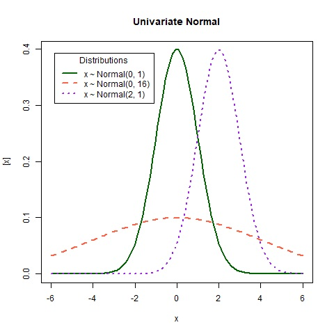
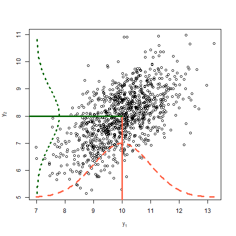
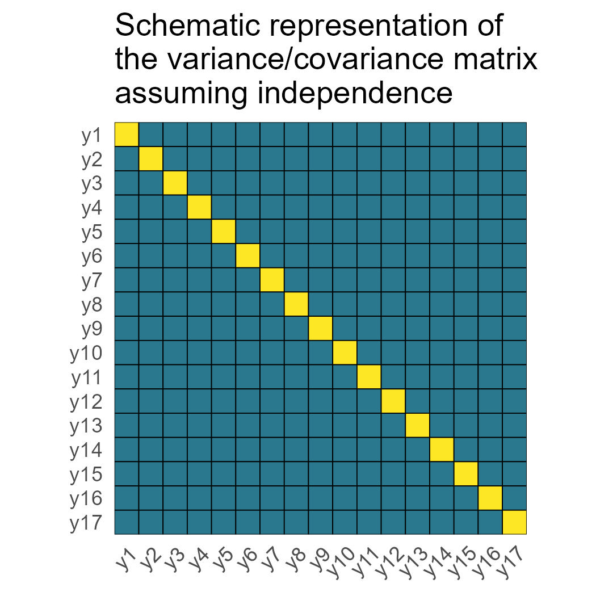
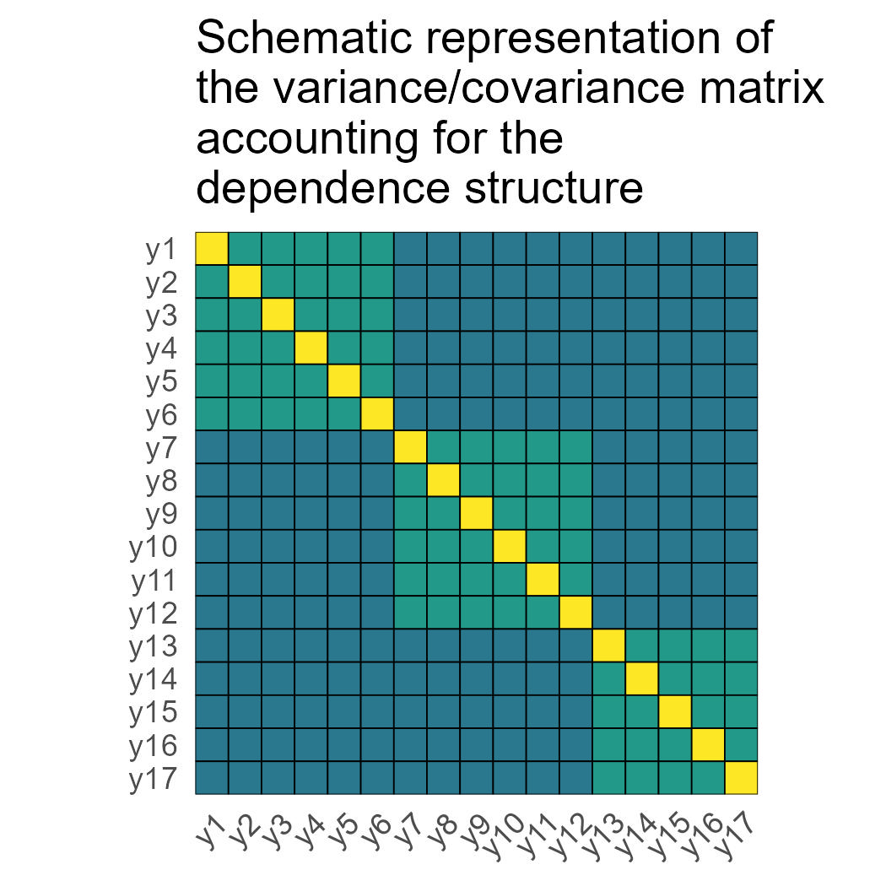
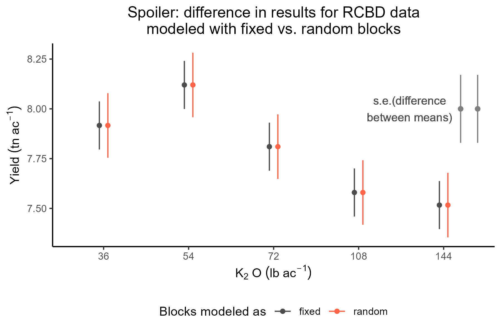
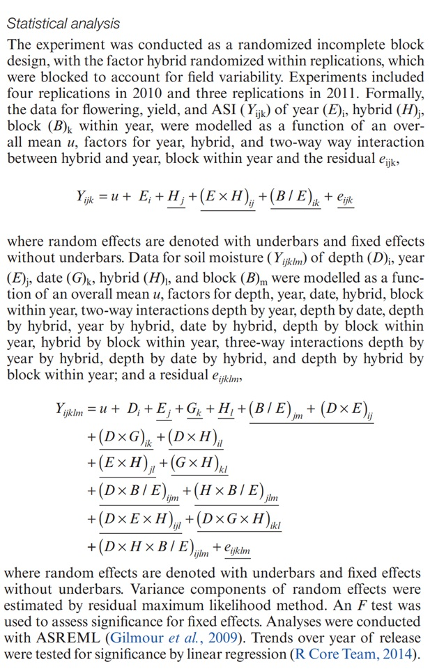
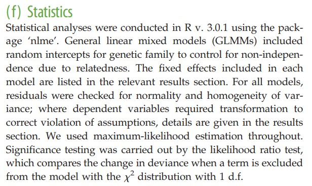

# Día 1 mañana: Introducción y repaso.     

5 de octubre de 2026 

## Housekeeping 

- We will have relatively low proportion of R code in this short course. Instead, we will focus on the understanding of the components of mixed-effects models. Questions/concerns via e-mail are encouraged.
- Emphasis on modeling and figuring out what mixed-effects models actually do.
- The statistical notation we will use throughout this workshop is presented [here](jlacasa.github.io/modelos-mixtos-fauba-2026/notes/index.html).
- [DON’T PANIC](https://en.wikipedia.org/wiki/Phrases_from_The_Hitchhiker%27s_Guide_to_the_Galaxy#Don't_Panic) when you see all the math notation and matrices. We will go slowly together. It is also not expected that you walk out of this workshop as a math notation wizard!

## Linear Models Review

- Why do we need statistical models? 
- Statistics as a summary of the data 
- ["Funes el memorioso" (J.L. Borges)](https://ciudadseva.com/texto/funes-el-memorioso/): *Sospecho, sin embargo, que no era muy capaz de pensar. Pensar es olvidar diferencias, es generalizar, abstraer. En el abarrotado mundo de Funes no había sino detalles, casi inmediatos*. 


- What is a statistical model? 

>Scientific models are, above all erlse, abstractions. They are statements about the operation of nature that purposefully omit many details and thus achieve insight that would otherwise be discursively obscured. Tehy provide unambiguous statements of what we believe is important. A key principle in modeling and statistics -- in science for that matter -- is the need to reduce the dimensions of a problem. (Hooten and Hobbs, 2015)


- Deterministic component + Stochastic component 

For example:

$y_i \sim N(\mu_i, \sigma^2), \\ \mu_i = \beta_0 + \beta_1 x_i$

### General linear model

One of the most popular linear models is the intercept-and-slope model (sometimes also called linear regression), 
often used to describe the (linear) relationship between two quantitative variables. 
Quadratic regression is also a linear model, and it's often used to describe relationship between two quantitative variables 
when it's not exactly linear, but has some type of curvature. 

Most of us learned a way of writing out the statistical model called "model equation form". 
For a quantitative predictor $x$, the model equation form is    

$$y_{i} = \beta_0 + x_{i} \beta_1 + x_{i}^2 \beta_2 + \varepsilon_{i}, \\ \varepsilon_i \sim N(0, \sigma^2),$$  

where $y_{i}$ is the observed value for the $i$th observation, 
$\beta_0$ is the intercept (i.e., the expected value of $y$ when $x=0$), 
$\beta_1$ is the linear component (i.e., the expected change in $y_i$ with a unity increase in $x$), 
$\beta_2$ is the quadratic component (i.e., the expected change in $y_i$ with a unity increase in $x^2$), 
$x_i$ is the predictor for the $i$th observation, 
and $\varepsilon_{i}$ is the difference between the observed value $y$ 
and the expected value $E(y_i) = \beta_0+x_i\beta_1+ x_{i}^2 \beta_2$ - that's why we often call it "residual". 
Typically, $\boldsymbol{\beta} \equiv \begin{bmatrix} \beta_0 \\ \beta_1 \\ \beta_2 \end{bmatrix}$ 
is estimated via maximum likelihood estimation. Also, when we assume a Normal distribution, 
maximum likelihood estimation yields the same point estimates as least squares estimation. 


### Qualitative predictors  

Instead of a quantitative predictor, we could have a qualitative (or categorical) predictor. 
Let the qualitative predictor have two possible levels, A and B. 
We could use the same model as before,  

$y_{i} \sim N(\mu_i, \sigma^2), \\ \mu_i = \beta_0 + x_i \beta_1,$

and say that $y_{i}$ is the observed value for the $i$th observation, 
$\beta_0$ is the expected value for A, 
$x_i = 0$ if the $i$th observation belongs to A, and $x_i = 1$ if the $i$th observation belongs to B.
That way, $\beta_1$ is the difference between A and B. 

If the categorical predictor has more than two levels, 

$y_{i} \sim N(\mu_i, \sigma^2), \\ \mu_i = \beta_0 + x_{1i} \beta_1 + x_{2i} \beta_2+ ... + x_{ji} \beta_j,$

$y_{i}$ is still the observed value for the $i$th observation, 
$\beta_0$ is the expected value for A (sometimes in designed experiments this level is a control), 

$$x_{1i} = \begin{cases}
    1, & \text{if } \text{Treatment is B} \\
    0, & \text{if } \text{else}
\end{cases}, $$
$$x_{2i} = \begin{cases}
    1, & \text{if } \text{Treatment is C} \\
    0, & \text{if } \text{else}
\end{cases}, $$
$$\dots,$$

$$x_{ji} = \begin{cases}
    1, & \text{if } \text{Treatment is J} \\
    1, & \text{if } \text{else}
\end{cases}. $$

That way, all $\beta$s are the differences between the treatment and the control. 

### Assumptions

Let's review the assumptions we make in this model (which is the default model in most software).   
- Linearity  
- Constant variance  
- Independence  
- Normality  


### Let's review that simple model using distribution notation and matrix notation

There are other ways of writing out the statistical model above besides the model equation form. 
Instead of focusing on the distribution of the residuals, we can focus on the distribution of the data $y$:  

$y_{i} \sim N(\mu_i, \sigma^2), \\ \mu_i = \beta_0 + x_{i} \beta_1 + x_{i}^2 \beta_2.$

This type of notation is called "probability distribution form". 
The probability distribution form makes it easier to switch to other distributions beyond the Normal ([Part e](3-lesson) of this workshop). 


::: {style="background-color: #f3f9d2; padding: 15px; border-radius: 5px; margin-top: 15px;"}
**Quick review: random variables**

**Random variables**

Random variables are usually described with their properties like the expected value and variance. The expected value and variance are the first and second central moments of a distribution, respectively. Regardless of the distribution of a random variable $Y$, we could calculate its expected value $E(Y)$ and variance $Var(Y)$. The expected value measures the average outcome of $Y$. The variance measures the dispersion of $Y$, i.e. how far the possible outcomes are spread out from their average.


<center>

</center>


Discuss in the plot above:

- Expected value 
- Variance
- Covariance?

**On the covariance of two random variables $y_1$ and $y_2$**

Covariance between two random variables means how the two random variables behave relative to each other. Essentially, it quantifies the relationship between their joint variability. The variance of a random variable is the covariance of a random variable with itself. Consider two variables $y_1$ and $y_2$, each with a variance of 1 and a covariance of 0.6. The data shown below arise from the multivariate normal distribution,
$$\begin{bmatrix}y_1 \\ y_2 \end{bmatrix} \sim MVN \left( \begin{bmatrix} 10 \\ 8 \end{bmatrix} , \begin{bmatrix}1 & 0.6 \\ 0.6 & 1 \end{bmatrix} \right),$$
where the means of $y_1$ and $y_2$ are 10 and 8, respectively, and their covariance structure is represented in the variance-covariance matrix. Remember,

$$\begin{bmatrix}y_1 \\ y_2 \end{bmatrix} \sim MVN \left( \begin{bmatrix} E(y_1) \\ E(y_2) \end{bmatrix} , \begin{bmatrix} Var(y_1) & Cov(y_1, y_2) \\ Cov(y_2,y_2) & Var(y_2) \end{bmatrix} \right).$$


<center>

</center>

Discuss in the plot above:

- Expected value
- Variance
- Covariance

```{r setup, include=FALSE}
library(htmltools)

popup_btn <- function(button_text, modal_text, modal_image = NULL) {
  # Generate a unique ID
  modal_id <- paste0("modal_", sample(100000:999999, 1))
  
  # Prepare the image HTML if a file path or URL is provided
  img_html <- ""
  if (!is.null(modal_image)) {
    img_html <- paste0('<div style="text-align: center; margin-top: 15px;">
                          
                        </div>')
  }
  
  # Write pure HTML as a template
  template <- '
    <div style="text-align: center; margin: 15px 0;">
      <button type="button" style="background-color: #e7c6ff; border: 1px solid #d1a8f0; padding: 6px 12px; cursor: pointer; border-radius: 4px; font-weight: 500;" onclick="document.getElementById(\'MODAL_ID\').style.display=\'block\'">BUTTON_TEXT</button>
    </div>
    <div id="MODAL_ID" style="display:none; position:fixed; z-index:9999; left:0; top:0; width:100%; height:100%; background-color:rgba(0,0,0,0.5); text-align: left;">
      <div style="background-color:#fff; margin:15% auto; padding:20px; border:1px solid #888; width:80%; max-width:600px; border-radius:8px; font-family: sans-serif;">
        <span onclick="document.getElementById(\'MODAL_ID\').style.display=\'none\'" style="color:#aaa; float:right; font-size:28px; font-weight:bold; cursor:pointer;">&times;</span>
        <p style="margin-top: 10px; font-size: 16px;">MODAL_TEXT</p>
        IMAGE_HTML
      </div>
    </div>
  '
  
  # Swap out the placeholders with your actual text and image
  html <- gsub("MODAL_ID", modal_id, template)
  html <- gsub("BUTTON_TEXT", button_text, html)
  html <- gsub("MODAL_TEXT", modal_text, html)
  html <- gsub("IMAGE_HTML", img_html, html)
  
  return(HTML(html))
}
```


`r popup_btn(button_text = "What would two random variables with zero covariance look like?", modal_text = "Here is what zero covariance looks like:", modal_image = "figures/normal_multivariate_0cov.jpg")`


**On the variance-covariance matrix:**

The variance-covariance matrix contains information about the covariance between all data points in the model. Consider the variance covariance matrix is a $n \times n$ square of tiles, where $n$ is the total number of observations. Each tile contains the information about the correlation between the combination of tiles. 
For example: 

- The tile at the intersection between the 1st and the 10th tile is $cov(y_1, y_{10})$. In this case, $cov(y_1, y_{10}) =0$. 
- The tile at (1,1) is $cov(y_1, y_{1}) = var(y_1) = \sigma^2$.

Recall that the single most common default model assumes independent residuals. This means that $cov(y_i, y_{i'}) = 0$ for all $i \neq i'$.

<center>

</center>

Mixed models relaxes the assumption of independent observations and affects the variance covariance matrix of the marginal distribution of $y$. 
For example: 

- The tile at the intersection between the 1st and the 10th tile is $cov(y_1, y_{10})$. In this case, $cov(y_1, y_{10}) =0$. 
- The tile at the intersection between the 1st and the 4th tile is $cov(y_1, y_{4})$. In this case, $cov(y_1, y_{4}) \neq 0$. 

- The exact formula for the different $cov(y_i, y_{i'})$ depends on the model assumptions. 


<center>

</center>


:::


```{r eval=FALSE, include=FALSE}
library(tidyverse)
sigma <- 2

diag(sigma^2, nrow = 17) |>  
  as.data.frame() |>  
  rownames_to_column("x") |>  
  pivot_longer(cols = -c(x), names_to = "y") |> 
  mutate(y = str_replace(y, "V", "") |>  as.numeric(),
         x = as.numeric(x)) |>  
  ggplot(aes(x,-y))+
  geom_tile(aes(fill = value), color = "black")+
  scale_fill_viridis_c(begin = 0.4, end = 1)+
  labs(fill = "variance/covariance")+
  coord_cartesian(xlim = c(.5,17.5), ylim = -c(.5,17.5), expand = F)+
  scale_x_continuous(breaks = 1:17, 
                     labels = paste0("y", 1:17))+
  scale_y_continuous(breaks = -c(1:17),
                     labels = paste0("y", 1:17))+
  theme_minimal()+
  theme(
    aspect.ratio = 1,
    panel.grid = element_blank(), 
    panel.background = element_blank(),
    axis.title = element_blank(), 
    legend.position = "none",
    axis.text.x = element_text(angle = 45, hjust = .92),
    plot.background = element_blank())

ggsave("figures/varcov_sigma2_I.jpg", width = 3.5, height = 3.5)  
```

```{r eval=FALSE, include=FALSE}
library(lme4)
m_cs <- lmer(diameter ~ time + (1|appleid), 
             data = agridat::byers.apple |> filter(appleid %in% c(1,4,32)))
Z <-  getME(m_cs, "Z") 
sigma2_s <- 1.2
G <- diag(c(rep(sigma2_s, 3)))

Z %*% G %*% t(Z) %>%
  as.matrix() %>% 
  as.data.frame() %>% 
  rownames_to_column("x") %>% 
  pivot_longer(cols = -c(x), names_to = "y") %>%
  mutate(x = as.numeric(x), y= as.numeric(y)) %>% 
  
  left_join(
  diag(sigma^2, nrow = 17) %>% 
  as.data.frame() %>% 
  rownames_to_column("x") %>% 
  pivot_longer(cols = -c(x), names_to = "y") %>%
  mutate(y = str_replace(y, "V", "") %>% as.numeric(),
         x = as.numeric(x)) %>% 
  rename(s2 = value)) %>% 

  ggplot(aes(x,-y))+
  geom_tile(aes(fill = value+s2), color = "black")+
  theme_minimal()+
  scale_fill_viridis_c(begin = 0.4, end = 1)+
  labs(fill = "variance/covariance")+
  coord_cartesian(xlim = c(.5,17.5), ylim = -c(.5,17.5), expand = F)+
  scale_x_continuous(breaks = 1:17, 
                     labels = paste0("y", 1:17))+
  scale_y_continuous(breaks = -c(1:17),
                     labels = paste0("y", 1:17))+
  theme_minimal()+
  theme(
    aspect.ratio = 1,
    panel.grid = element_blank(), 
    panel.background = element_blank(),
    axis.title = element_blank(), 
    legend.position = "none",
    axis.text.x = element_text(angle = 45, hjust = .92),
    plot.background = element_blank())

ggsave("figures/varcov_ZGZ_sigmaI.jpg", width = 3.5, height = 3.5)  
```


\break


Now that we've covered the variance-covariance matrices, we can further express the general linear model using vectors and matrices:  

$$\mathbf{y} \sim N(\boldsymbol{\mu}, \Sigma), \\ \boldsymbol{\mu} = \boldsymbol{1} \beta_0 + \mathbf{x} \beta_1 = \mathbf{X}\boldsymbol{\beta},$$

where $n$ is the total number of observations, $p$ is the total number of parameters, 
$\mathbf{y}$ is an $n \times 1$ vector containing all observations, 
$\boldsymbol{\mu}$ is an $n \times 1$ vector containing the expected values of said observations, 
$\boldsymbol{\beta}$ is an $p \times 1$ vector containing the (fixed) parameters, 
$\mathbf{X}$ is an $n \times p$ matrix containing the predictors, 
$\Sigma$ is an $n \times n$ matrix called variance-covariance matrix. 
*Note: This type of notation is also convenient to think about how to prepare the data in your spreadsheet. One row per observation (rows in $\mathbf{X}$), one variable per column (columns in $\mathbf{X}$).*

These expressions can be expanded into: 

$$\begin{bmatrix}y_1 \\ y_2 \\ \vdots \\ y_n \end{bmatrix} \sim  N \left( \begin{bmatrix}\mu_1 \\ \mu_2 \\ \vdots \\ \mu_n \end{bmatrix}, 
\begin{bmatrix} Cov(y_1, y_1) & Cov(y_1, y_2) & \dots & Cov(y_1, y_n) \\
Cov(y_2, y_1) & Cov(y_2, y_2) & \dots & Cov(y_2, y_n)\\
\vdots & \vdots & \ddots & \vdots \\ 
Cov(y_n, y_1) & Cov(y_n, y_2) & \dots & Cov(y_n, y_n) \end{bmatrix} \right),$$

which is the same as 

$$\begin{bmatrix}y_1 \\ y_2 \\ \vdots \\ y_n \end{bmatrix} \sim N \left( \begin{bmatrix}\mu_1 \\ \mu_2 \\ \vdots \\ \mu_n \end{bmatrix}, 
\begin{bmatrix} Var(y_1) & Cov(y_1, y_2) & \dots & Cov(y_1, y_n) \\
Cov(y_2, y_1) & Var(y_2) & \dots & Cov(y_2, y_n)\\
\vdots & \vdots & \ddots & \vdots \\ 
Cov(y_n, y_1) & Cov(y_n, y_2) & \dots & Var(y_n) \end{bmatrix} \right).$$


## Fixed effects and random effects 


What is behind a random effect:  

- We assume a distribution of the effects, for example $u_j \sim N(0, \sigma^2_u)$ 
- What process is being studied?  
- How were the levels selected? (randomly, carefully selected)  
- How many levels does the factor have, vs. how many did we observe?   
- BLUEs versus BLUPs. 

Read more in in Gelman (2005, page 20). "Analysis of variance—why it is more important than ever". [[link](https://projecteuclid.org/journals/annals-of-statistics/volume-33/issue-1/Analysis-of-variancewhy-it-is-more-important-than-ever/10.1214/009053604000001048.full)], and [Gelman and Hill (2006), page 245](https://sites.stat.columbia.edu/gelman/arm/) 

::: {style="background-color: #A7CECB; padding: 15px; border-radius: 5px; margin-top: 15px;"}

**In-class activity:** what determines if an effect should be random of fixed? 

**Case:** scientists have decided they wanted to have 3 different environments (SE Kansas, NW Kansas, Central Kansas) for their experiments. 
They design a randomized complete block design at each location.  
However, they are not interested in studying the environments themselves. 
How should they model the data generated by the experiment?

:::


### Applied example  

-   Field experiment studying the effect of potassium on corn yield.   
-   One treatment factor: Potassium fertilizer (one-way treatment structure).  
-   Randomized Complete Block Design with 4 repetitions (design structure).  


```{r fig.height=10, fig.align='center'}

```


### Building a statistical model  

1. What is the *experiment blueprint*? (aka design structure or structure in the data)  
2. What are the treatments?  

We can easily come up with two models:

1.  Blocks fixed $y_{ijk} = \mu + \tau_i + \rho_j + \varepsilon_{ijk}; \ \ \varepsilon_{ijk} \sim N(0, \sigma^2)$.  
2.  Blocks random $y_{ijk} = \mu + \tau_i + u_j + \varepsilon_{ijk}; \ \ u_j \sim N(0, \sigma^2_u); \ \ \varepsilon_{ijk} \sim N(0, \sigma^2)$, 
where $u$ and $\varepsilon$ are independent.

<html lang="en">
<head>
    <meta charset="UTF-8">
    <meta name="viewport" content="width=device-width, initial-scale=1.0">
    <title>Embed R Code</title>
    <style>
        pre {
            background-color: #f4f4f4;
            padding: 10px;
            border: 1px solid #ccc;
            border-radius: 5px;
            overflow-x: auto; /* Enables horizontal scrolling if the code is too wide */
        }
    </style>

```{r echo=FALSE}
library(lme4)
library(tidyverse)
library(emmeans)
library(latex2exp)

df <- read.csv("../data/cochrancox_kfert.csv")
df$rep <- as.factor(df$rep)
df$K2O_lbac <- as.factor(df$K2O_lbac)
m_fixed <- lm(yield ~ K2O_lbac + rep, data = df)
m_random <- lmer(yield ~ K2O_lbac + (1|rep), data = df)

(mg_means_fixed <- emmeans(m_fixed, ~K2O_lbac, contr = list(c(1, 0, 0, 0, -1))))

```


--------


## Discussions  

Now we know what we mean when we say "factor A was considered fixed and factor B was considered random"!  

**Group discussion:** 


**Example 1:** A study to find out if water capture increased as the result of selection for yield in SX hybrids in the US corn-belt (Reyes et al., 2015). [[link](https://doi.org/10.1093/jxb/erv430)]


```{r fig.height=10, fig.align='center', caption = 'Section from Materials and Methods section from a peer-reviewed publication.', echo=FALSE}
  
```

**Example 2:** A study to find out if developmental telomere attrition is a measure of state in birds, and hence should predict state-dependent decisions such as the relative value assigned to immediate versus delayed food rewards (Bateson et al., 2014). [[link](#)]


```{r fig.height=10, fig.align='center', caption = 'Section from Materials and Methods section from a peer-reviewed publication.', echo=FALSE}
  
```


## Summary

<head>
    <meta charset="UTF-8">
    <meta name="viewport" content="width=device-width, initial-scale=1.0">
    <title>Fixed vs Random Effects Table</title>
    <style>
        table {
            width: 100%;
            border-collapse: collapse;
            margin: 20px 0;
        }
        th, td {
            border: 1px solid #ddd;
            padding: 8px;
            text-align: left;
        }
        th {
            background-color: #f4f4f4;
            font-weight: bold;
        }
        tr:nth-child(even) {
            background-color: #f9f9f9;
        }
    </style>
</head>

<body>

<table>
    <tr>
        <th> </th>
        <th>Fixed effects</th>
        <th>Random effects</th>
    </tr>
    <tr>
        <th>Where</th>
        <td>Expected value</td>
        <td>Variance-covariance matrix</td>
    </tr>
    <tr>
        <th>Inference</th>
        <td>Constant for all groups in the population of study</td>
        <td>Differ from group to group</td>
    </tr>
    <tr>
        <th>Usually used to model</th>
        <td>Carefully selected treatments or genotypes</td>
        <td>The study design (aka structure in the data, or what is similar to what)</td>
    </tr>
    <tr>
        <th>Estimation</th>
        <td>$\hat{\boldsymbol{\beta}} \sim N \left( \boldsymbol{\beta}, (\mathbf{X}^T \mathbf{V}^{-1} \mathbf{X})^{-1} \right)$</td>
        <td>$u_j \sim N(0, \sigma^2_u)$</td>
    </tr>
    <tr>
        <th>Method of estimation</th>
        <td>Maximum likelihood, least squares. BLUEs.</td>
        <td>Restricted maximum likelihood (shrinkage). BLUPs</td>
    </tr>
</table>
</body>


