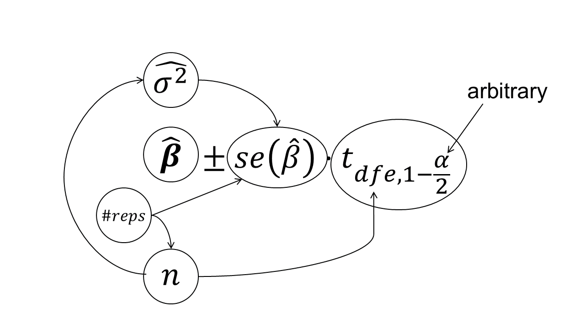

# Día 1 (tarde): Introducción a los modelos mixtos (cont.)

## Review of some elements for statistical inference 

Most of us use statistics as a tool to summarize our data and obtain statistical inference.
That is, we often wish to **estimate** the effect of a factor on our response. 
Sometimes, we even wish to **attribute** some effect to some factor (e.g., significance testing). 
Other times, we wish to **predict** the response under a given condition. 
More on prediction, estimation, and attribution in [Efron (2020)](https://www.tandfonline.com/doi/abs/10.1080/01621459.2020.1762613). 
Designed experiments often have estimation and attribution goals. 

Some desirable characteristics of our estimators are 

- Unbiased estimates 
  - We typically model our treatment effects via parameter estimates (e.g., $\hat\beta$) 
  - Unbiased means that $E(\hat\beta) = \beta$.  
- Precise estimates 
  - Confidence intervals indicate the amount of information we have around our point estimates $CI_{\hat{\theta} \ 95\%} = \hat{\theta} \pm se(\hat{\theta}) \cdot t_{df, \ 1 - \frac{\alpha}{2}}$


### Live demonstration: $s.e.(\hat\mu)$ 

[Get R code](../scripts/dia1_se_demo.qmd)


### Hypothesis tests  

Hypothesis tests aim to test whether the data could have been generated under a 'Null hypothesis' $H_0$, or if they are too extreme for that to be a reasonable assumption. 
When testing population means with an unknown variance, we use a t-test.

Typically, a t-test framework consists of:

- A test statistic: $t^{\star} = \frac{\hat{\theta} - \theta_0}{se(\hat{\theta})}$, including:
  - **An estimate** $\hat{\theta}$ that can be any combination of parameters, for example: 
    - $(\mu_1 - \mu_2) - 0$ to test mean differences 
    - $\mu_1 - 0$ to test whether a mean (or effect) is zero 
  - **The standard error estimates of $\hat{\theta}$, derived from the data:** the true population variance $\sigma^2$ is unknown and the $se$ relies on the sample variance $\hat{\sigma}^2$ (typically some variation of $\sqrt{\frac{\hat{\sigma}^2}{n}}$) 
  - Adaptations are based on the experimental design and research question 
  - The exact formulas for $se$ and degrees of freedom ($df$) adapt depending on whether the test is a one-sample, independent two-sample, or paired design. 
- A reference $t$ distribution $t_{df}$ to evaluate the test statistic.  
- A level of significance $\alpha$. 


**Inference in t-tests:**

We consider that there is enough evidence to reject the null hypothesis when $P(t_{df}>|t^{\star}|)<\alpha$. 

**Note: Hypothesis tests are directly connected to confidence intervals:**

- $CI_{\hat{\theta} \ 95\%} = \hat{\theta} \pm se(\hat{\theta}) \cdot t_{df, \ 1 - \frac{\alpha}{2}}$ 

### On p-values 

- The p value is the probability of observing a value as extreme or more extreme than the [t/F] statistic under the null hypothesis. 
- Often, we assume $\alpha = 0.05$, and reject $H_0$ if $p<\alpha$. 
- [ASA's statement on p-values](https://www.amstat.org/asa/files/pdfs/p-valuestatement.pdf) 
- [Scientists rise up against statistical significance](https://www.nature.com/articles/d41586-019-00857-9) 
  - [Discussion](https://statmodeling.stat.columbia.edu/2019/03/20/retire-statistical-significance-the-discussion/) 
  - Counterargument: [In defense of p-values](https://esajournals.onlinelibrary.wiley.com/doi/10.1890/13-0590.1) 
- Gelman "Let us have the serenity to embrace the variation that we cannot reduce, the courage to reduce the variation we cannot embrace, and the wisdom to distinguish one from the other." [[see talk](https://www.youtube.com/watch?v=KS3yPw91iC0&t=3252s)] 


::: {style="background-color: #C2EFB3; padding: 15px; border-radius: 5px; margin-top: 15px;"}

### Summary 

- Statistical inference relies on point estimates and variance estimates 
- Variance estimates may arguably affect conclusions even more than point estimates 
- Degrees of freedom may affect $t$, and thus the conclusions of a study  

```{r fig.height=5, fig.align='center', echo=FALSE, caption = 'Connections between elements of statistical models and statistical inference.'}

```

:::  


## Estimation of variance components in mixed models

For any unknown parameter, there are multiple ways to estimate it. 
We call those the methods of estimation. 
We know that the variance estimates may affect our conclusions, which is why bias is a really undesired property for variance estimators. 
Three of the most common methods for estimating variance components in mixed models are maximum likelihood estimation, restricted maximum likelihood estimation, and method of moments estimation. 


### Maximum Likelihood Estimation (MLE)

**Maximum Likelihood Estimation** of variance components provides downward biased estimates for small data (most experimental data). 
$\ell_{ML}(\boldsymbol{\sigma; \boldsymbol{\beta}, \mathbf{y}}) = - (\frac{n}{2}) \log(2\pi)-(\frac{1}{2}) \log ( \vert \mathbf{V}(\boldsymbol\sigma) \vert ) - (\frac{1}{2}) (\mathbf{y}-\mathbf{X}\boldsymbol{\beta})^T[\mathbf{V}(\boldsymbol\sigma)]^{-1}(\mathbf{y}-\mathbf{X}\boldsymbol{\beta})$  

### Restricted Maximum Likelihood (REML)

**Restricted Maximum Likelihood** (REML) avoids MLE's downward bias under small data and is thus is the default in most mixed effects models. 

- In REML, the likelihood is maximized **after** accounting for the model’s fixed effects.  
- In REML, $\ell_{REML}(\boldsymbol{\sigma};\mathbf{y}) = - (\frac{n-p}{2}) \log (2\pi) - (\frac{1}{2}) \log ( \vert \mathbf{V}(\boldsymbol\sigma) \vert ) - (\frac{1}{2})log \left(  \vert \mathbf{X}^T[\mathbf{V}(\boldsymbol\sigma)]^{-1}\mathbf{X} \vert \right) - (\frac{1}{2})\mathbf{r}[\mathbf{V}(\boldsymbol\sigma)]^{-1}\mathbf{r}$, 
where $p = rank(\mathbf{X})$, $\mathbf{r} = \mathbf{y}-\mathbf{X}\hat{\boldsymbol{\beta}}_{ML}$.  
  - Start with initial values for $\boldsymbol{\sigma}$, $\tilde{\boldsymbol{\sigma}}$.  
  - Compute $\mathbf{G}(\tilde{\boldsymbol{\sigma}})$ and $\mathbf{R}(\tilde{\boldsymbol{\sigma}})$.  
  - Obtain $\boldsymbol{\beta}$ and $\mathbf{b}$.   
  - Update $\tilde{\boldsymbol{\sigma}}$.  
  - Repeat until convergence.  
- Variance components may be $<0$; in that case they are set to zero. 

### Method of moments (MoM)

**Method of moments** (MoM) is derived from ANOVA tables that include the expected mean squares. 

- Use actual sums of squares and expected mean squares (EMS) from ANOVA to clear for the different variance components. 
- e.g., $\tilde{\sigma}^2_{w} = \frac{SSw - SS_e}{c}$ (See table above). However, if $\tilde{\sigma}^2_{w} < 0$, $\hat{\sigma}^2_{w} = 0$. 

- Issues with variance estimates equal to zero 
  - Type I error inflation 
  - [Frey et al. (2024)](https://acsess.onlinelibrary.wiley.com/doi/10.1002/agj2.21570) 


## Degrees of freedom

Mixed models do not trace to the classical concept of degrees of freedom. In hierarchical models, rigidly counting parameters for degrees of freedom is conceptually problematic.

The independent pieces of information shift depending on group sizes and variance: a group-level coefficient modeled as a random effect does not consume exactly $1$ degree of freedom (as an unpooled fixed effect would), nor does it consume $0$ (as a completely pooled grand mean would). Instead, the effective degrees of freedom consumed by a set of random effects lies somewhere between $1$ and $J$ (where $J$ is the total number of groups).

The effective degrees of freedom depend on the magnitude of between-group versus within-group variance: if group variation is high, degrees of freedom approach the number of groups; if low, they approach the total sample size.

- Contrasts for balanced \& complete designs have straightforward calculation of degrees of freedom. 
- For unbalanced designs, incomplete blocks, missing data, and cases with more complex variance-covariance structure, the ANOVA shell does not give us exact degrees of freedom. 
- Downward bias of the variance of an estimable function, leading to: 
  - too narrow confidence intervals 
  - inflated type I error rates 
- Bias adjustment methods estimate the approximate degrees of freedom, which might be a non-integer number.  

**Satterthwaite approximation**  

- [Paper](https://www.jstor.org/stable/3002019?seq=1)  

Let $\frac{X^2_{num}/\nu_1}{X_2^\star/\nu^\star_2}$ be the ratio of interest, where $X_{num}^2 \sim \chi^2_{\nu_1}$ and $X_2^\star$ is a linear combination of chi-square random variables all independent of $X_{num}^2$, then $X_2^\star \sim$ approximately $\chi^2_{\nu^\star_2}$, where

$$\nu_2^\star \equiv \frac{(\sum_m c_m X_m^2)^2}{\sum_m\frac{(c_m X_m^2)}{df_m}}.$$

**Kenward-Roger approximation** 

- [Paper](https://www.jstor.org/stable/2533558?seq=1) 
- Based on REML 
- Focused on $(\mathbf{X}^T\mathbf{V}^{-1} \mathbf{X})^{-1}$ (the variance of $\hat{\boldsymbol\beta}$)
- Again, expept for variance-component-only LMMs with balanced data and their compound symmetry marginal model equivalents, the estimated covariance of $\beta \mathbf{K}$ will tend to be underestimated. 
- KR somewhat more conservative and reliable than Satterthwaite ([source](https://link.springer.com/article/10.1198/108571102726)). 
- Integrated in most statistical software. 

**R implementation** 

- `emmeans` uses Kenward-Roger by default. [[see vignette](https://cran.r-project.org/web/packages/emmeans/vignettes/sophisticated.html)] 
- Everything is more tricky in GLMMs (`df` is `Inf` in most applications). 


## Exercises

### Exercise 1: Modeling Decisions

An agronomist evaluates the performance of 4 specific nitrogen rates on winter wheat yield. 
To ensure the results are widely applicable, the trial is replicated across 12 arbitrarily selected farms across the state. 

**1.a.** Based on our discussion of how levels are selected and the scope of inference, explain which factor(s) should be modeled as fixed and which as random. 
Detail how the choice of a random effect here impacts the variance-covariance matrix of the marginal distribution.

**1.b.** Write the statistical model described in **1.a.**

### Exercise 2: Variance-Covariance Matrix Construction

Consider a simple randomized complete block design (RCBD) with 3 treatments and 2 blocks (total $n = 6$ observations).

**2.a.** If blocks are modeled as fixed effects, what do we expect for the standard error of the mean, and what do we expect for the standard error of mean differences? 

**2.b.** If blocks are modeled as random effects ($u_j \sim N(0, \sigma^2_u)$), what do we expect for the standard error of the mean, and what do we expect for the standard error of mean differences? 

**2.c.** If blocks are modeled as random effects, write out the theoretical covariance between observation 1 (Block 1, Trt A) and observation 2 (Block 1, Trt B). How does this differ from observation 1 (Block 1, Trt A) and observation 4 (Block 2, Trt A)?


### Exercise 3: REML vs MLE in Practice

Using the m_random model object below:

```{r}
library(lme4)
url <- "https://raw.githubusercontent.com/jlacasa/modelos-mixtos-fauba-2026/refs/heads/main/data/cochrancox_kfert.csv"
df <- read.csv(url)
# df <- read.csv("../data/cochrancox_kfert.csv")
df$rep <- as.factor(df$rep)
df$K2O_lbac <- as.factor(df$K2O_lbac)
m_random <- lmer(yield ~ K2O_lbac + (1|rep), REML = TRUE, data = df)
```


**3.a.** Re-fit the model using maximum likelihood estimation (MLE) for the variance components.

**3.b.** Compare the variance component for the random block effect (rep) between the REML and MLE models. Explain why the variance estimate differs between the two methods and why REML is the preferred default in agricultural experiments. 

## Tarea para mañana:
 
Leer [Dixon (2016)](../handouts/2016_Dixon_ShouldBlocks.pdf). 

