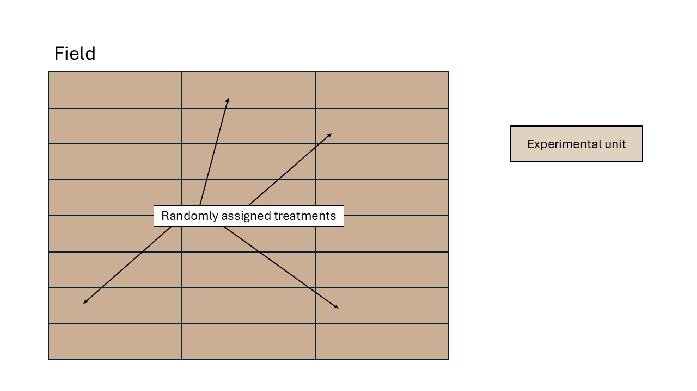
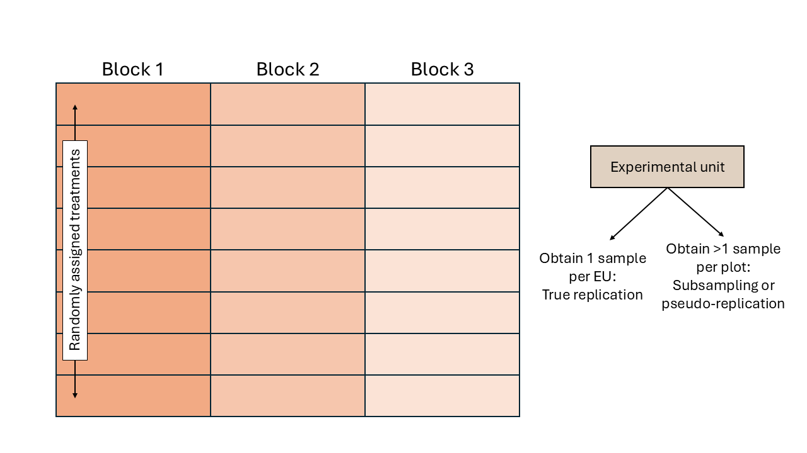
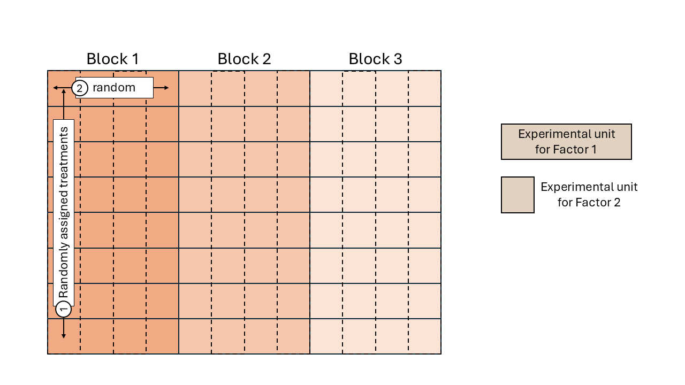

# Día 2 (mañana): Conexión entre diseños experimentales y modelos estadísticos.     

6 de octubre de 2026 

## Discusión: qué dice Dixon? 

- Discusión del paper Dixon (2016) -- 30 minutos. 


## Review: designed experiments

**Golden Rules of designed experiments:**  
- Randomization  
- Replication  
- Local control  


### Describing a designed experiment 

**Treatment structure**

"The treatment structure of a designed experiment consists of the set of
treatments, factors, treatment combinations, or populations that the experimenter has
selected to study and/or compare." (Chapter 4 in [Milliken and Johnson, 2004](https://www.taylorfrancis.com/books/mono/10.1201/EBK1584883340/analysis-messy-data-volume-1-dallas-johnson-george-milliken))

Some examples are:

- One-way treatment structures 
- Factorial treatment structures 
- Factorial treatment structures plus control 
- Fractional factorial treatment structures 
- Other designs in the [response surface methodology](https://en.wikipedia.org/wiki/Response_surface_methodology) literature (continuous predictors).

### Design structure

"The design structure of a designed experiment consists of the grouping of
the experimental units into homogeneous groups or blocks." (Chapter 4 in [Milliken and Johnson, 2004](https://www.taylorfrancis.com/books/mono/10.1201/EBK1584883340/analysis-messy-data-volume-1-dallas-johnson-george-milliken))

::: {style="background-color: #C2EFB3; padding: 15px; border-radius: 5px; margin-top: 15px;"}

**Experimental unit versus observational unit**  
- Experimental unit (EU): smallest entity to which a treatment is independently assigned.  
- Observational unit (OU): entity on which observations are made. 
- If OU $$>$$ EU, not all observations are independent. 
- The variance estimated from pseudoreplications (subsamples) is usually smaller than the variance estimated from true replications (experimental units). 

:::

### What would Fisher do (WWFD) ANOVA

Analysis of variance (ANOVA) has multiple appealing characteristics: 

- Summary of the data 
- Describe 

The ANOVA structure for a nested structure can be hard to build. 

#### Completely Randomized Design (CRD)  

We assume that all experimental units experienced similar conditions. 
In a field experiment setting, that means that all plots were located in an
approximately homogeneous area. 
Observations are thus assumed independent to each other. 


```{r fig.height=5, fig.align='center', echo=FALSE, caption = 'Schematic diagram of a completely randomized design (CRD)'}

```


**Statistical model** the independent assumption seems reasonable, which is why 
we can keep the model where 

$$y_{i} = \mu + \tau_i + \varepsilon_{i},\\
\varepsilon_{i} \sim N(0, \sigma^2).$$

Let's expand the variance-covariance matrix: 

$$\Sigma = \begin{bmatrix} \sigma^2 & 0 & 0 & 0 & \dots & 0 \\ 
0 & \sigma^2 & 0 & 0 & \dots & 0 \\
0 & 0 & \sigma^2 & 0 & \dots & 0 \\
0 & 0 & 0 & \sigma^2 & \dots & 0 \\
\vdots & \vdots & \vdots & \vdots & \ddots & \vdots\\  
0 & 0 & 0 & 0 & \dots & \sigma^2 \end{bmatrix}.$$

Note that the elements in the off-diagonals are zeroes, because we are still keeping the 
assumption of independence (for now...). 

#### Randomized complete block design (RCBD)  

We assume that the experimental units did not experience similar conditions, 
but that an expert could determine groups of experimental units that did experience similar conditions. 
We call these groups of experimental units that experienced similar conditions "Blocks". 
In a field experiment setting, that means that groups of plots were located in
approximately homogeneous areas called blocks. 
In a study dealing with animals,this could be a repetition (i.e., a group 
of animals studied for the same timeframe).
In a laboratory setting,this could be a day or a week where the scientists 
run the experiment. 


```{r fig.height=5, fig.align='center', echo=FALSE, caption = 'Schematic diagram of a randomized complete block design (RCBD)'}

```


`r popup_btn(button_text = "RCBD example for animal science.", modal_text = "Here is what an RCBD for a barn experiment looks like:", modal_image = "figures/pigs_rcbd.PNG")`


All observations from the same block shared the same conditions and thus, 
shared a random effect for the intercept.
Said common random effect for the intercept means that observations 
sharing a block are correlated. We can write out the statistical model

$$y_{ij} = \mu + \tau_i + u_j + \varepsilon_{ij},\\
u_{j} \sim N(0, \sigma^2_u), \\
\varepsilon_{ij} \sim N(0, \sigma^2),$$

where $y_{ijk}$ is the observation for the $i$th treatment in the $j$th block, 
$\mu$ is the overall mean, 
$\tau_i$ is the effect of the $i$th treatment, 
$u_k$ is the random effect of the $k$th block, 
and $\varepsilon_{ij}$ is the residual. 

Assuming observations 1 to 10 belong to:  


<head>
    <meta charset="UTF-8">
    <meta name="viewport" content="width=device-width, initial-scale=1.0">
    <title>Fixed vs Random Effects Table</title>
    <style>
        table {
            width: 50%;
            border-collapse: collapse;
            margin: 20px 0;
        }
        th, td {
            border: 1px solid #ddd;
            padding: 4px;
            text-align: left;
        }
        th {
            background-color: #f4f4f4;
            font-weight: bold;
        }
        tr:nth-child(even) {
            background-color: #f9f9f9;
        }
    </style>
</head>

<body>

<table>
    <tr>
        <th>Block</th>
        <th>Treatment</th>
        <th>Response</th>
    </tr>
    <tr>
        <td>1</td>
        <td>H</td>
        <td>16.8</td>
    </tr>
    <tr>
        <td>1</td>
        <td>C</td>
        <td>14.02</td>
    </tr>
    <tr>
        <td>1</td>
        <td>A</td>
        <td>11.37</td>
    </tr>
    <tr>
        <td>1</td>
        <td>G</td>
        <td>12.30</td>
    </tr>
    <tr>
        <td>1</td>
        <td>D</td>
        <td>12.1</td>
    </tr>
    <tr>
        <td>1</td>
        <td>E</td>
        <td>12.04</td>
    </tr>
    <tr>
        <td>1</td>
        <td>F</td>
        <td>14.5</td>
    </tr>
    <tr>
        <td>1</td>
        <td>B</td>
        <td>9.8</td>
    </tr>
    <tr>
        <td>2</td>
        <td>E</td>
        <td>10.5</td>
    </tr>
    <tr>
        <td>2</td>
        <td>F</td>
        <td>14.1</td>
    </tr>
</table>
</body>


$$\Sigma = \begin{bmatrix} 
\sigma^2 + \sigma^2_u & \sigma^2_u & \sigma^2_u & \sigma^2_u & \sigma^2_u & \sigma^2_u & \sigma^2_u & \sigma^2_u & 0 & 0 & \dots & 0 \\ 
\sigma^2_u & \sigma^2 + \sigma^2_u & \sigma^2_u & \sigma^2_u & \sigma^2_u & \sigma^2_u & \sigma^2_u & \sigma^2_u & 0 & 0 & \dots & 0 \\
\sigma^2_u & \sigma^2_u & \sigma^2 + \sigma^2_u & \sigma^2_u & \sigma^2_u & \sigma^2_u & \sigma^2_u & \sigma^2_u & 0 & 0 & \dots & 0 \\
\sigma^2_u & \sigma^2_u & \sigma^2_u & \sigma^2 + \sigma^2_u & \sigma^2_u & \sigma^2_u & \sigma^2_u & \sigma^2_u & 0 & 0 & \dots & 0 \\
\sigma^2_u & \sigma^2_u & \sigma^2_u & \sigma^2_u & \sigma^2 + \sigma^2_u & \sigma^2_u & \sigma^2_u & \sigma^2_u & 0 & 0 & \dots & 0 \\
\sigma^2_u & \sigma^2_u & \sigma^2_u & \sigma^2_u & \sigma^2_u & \sigma^2 + \sigma^2_u & \sigma^2_u & \sigma^2_u & 0 & 0 & \dots & 0 \\
\sigma^2_u & \sigma^2_u & \sigma^2_u & \sigma^2_u & \sigma^2_u & \sigma^2_u & \sigma^2 + \sigma^2_u & \sigma^2_u & 0 & 0 & \dots & 0 \\
\sigma^2_u & \sigma^2_u & \sigma^2_u & \sigma^2_u & \sigma^2_u & \sigma^2_u & \sigma^2_u & \sigma^2 + \sigma^2_u & 0 & 0 & \dots & 0 \\
0 & 0 & 0 & 0 & 0 & 0 & 0 & 0 & \sigma^2 + \sigma^2_u & \sigma^2_u & \dots & 0 \\
0 & 0 & 0 & 0 & 0 & 0 & 0 & 0 & \sigma^2_u & \sigma^2 + \sigma^2_u & \dots & 0 \\
\vdots & \vdots & \vdots & \vdots & \vdots & \vdots & \vdots & \vdots & \vdots & \vdots & \ddots & \vdots\\  
0 & 0 & 0 & 0 & 0 & 0 & 0 & 0 & 0 & 0 & \dots & \sigma^2 + \sigma^2_u \end{bmatrix}.$$


#### Split-plot design    

Split-plot designs are hierarchical types of designs with at least two 
treatment factors, where the experimental unit for one 
treatment contains multiple experimental units of another treatment factor.
The reason for this type of designs often go back to practical limitations 
for the application of some treatment factor (e.g., agricultural machinery that 
imposes the experimental unit size), making
split-plot designs more convenient. 

Treatments are randomized in a stepwise fashion:  
1. The levels of one treatment factor are randomly assigned to its 
experimental units (whole plots). In an RCBD, the treatments for the whole plots 
are randomly assigned within each block. 
2. **Within the whole plots**, the levels of the other treatment factor are 
randomly assigned to its experimental units (split plots), which are 
subsections of the whole plots. Note: we could think of the whole plots acting 
as "mini blocks" for the second treatment factor. 


```{r fig.height=5, fig.align='center', echo=FALSE, caption = 'Schematic diagram of a split-plot design'}

```


`r popup_btn(button_text = "Split-plot example for animal science.", modal_text = "Here is what a split-plot for a barn experiment looks like:", modal_image = "figures/pigs_splitplot.PNG")`


Again, all observations from the same block share the same random effect and are correlated.  
Likewise, all observations from the same whole plot (i.e., "mini block") are correlated. 

$$y_{ijk} = \mu + \tau_i + \alpha_j + (\tau \alpha)_{ij} + u_k + v_{i \vert k} + \varepsilon_{ij},\\
u_{k} \sim N(0, \sigma^2_u), \\
v_{i \vert k} \sim N(0, \sigma^2_v), \\
\varepsilon_{ijk} \sim N(0, \sigma^2),$$

where $y_{ijk}$ is the observation for the $i$th level of treatment factor 1, $j$th level of treatment factor 2, in the $k$th block, 
$\mu$ is the overall mean, 
$\tau_i$ is the main effect of the $i$th level of treatment factor 1, 
$\alpha_j$ is the main effect of the $j$th level of treatment factor 2, 
$(\tau \alpha)_{ij}$ is their interaction, 
$u_k$ is the random effect of the $k$th block, 
$v_{i \vert k}$ is the random effect of the $i$th "miniblock" (whole plot) in the $k$th block,
and $\varepsilon_{ij}$ is the residual. 

Assuming observations 1 to 4 belong to:  
<head>
    <meta charset="UTF-8">
    <meta name="viewport" content="width=device-width, initial-scale=1.0">
    <title>Fixed vs Random Effects Table</title>
    <style>
        table {
            width: 50%;
            border-collapse: collapse;
            margin: 20px 0;
        }
        th, td {
            border: 1px solid #ddd;
            padding: 4px;
            text-align: left;
        }
        th {
            background-color: #f4f4f4;
            font-weight: bold;
        }
        tr:nth-child(even) {
            background-color: #f9f9f9;
        }
    </style>
</head>

<body>

<table>
    <tr>
        <th>Block</th>
        <th>Treatment Factor 1</th>
        <th>Treatment Factor 2</th>
        <th>Response</th>
    </tr>
    <tr>
        <td>1</td>
        <td>H</td>
        <td>a</td>
        <td>17.2</td>
    </tr>
    <tr>
        <td>1</td>
        <td>H</td>
        <td>c</td>
        <td>16.2</td>
    </tr>
    <tr>
        <td>1</td>
        <td>H</td>
        <td>b</td>
        <td>16.9</td>
    </tr>
    <tr>
        <td>1</td>
        <td>H</td>
        <td>d</td>
        <td>16.7</td>
    </tr>
    <tr>
        <td>1</td>
        <td>C</td>
        <td>d</td>
        <td>14.7</td>
    </tr>
    <tr>
        <td>1</td>
        <td>C</td>
        <td>c</td>
        <td>14.1</td>
    </tr>
    <tr>
        <td>1</td>
        <td>C</td>
        <td>b</td>
        <td>13.7</td>
    </tr>
    <tr>
        <td>1</td>
        <td>C</td>
        <td>a</td>
        <td>13.5</td>
    </tr>
    <tr>
        <td>1</td>
        <td>A</td>
        <td>c</td>
        <td>11.5</td>
    </tr>
    <tr>
        <td>1</td>
        <td>A</td>
        <td>d</td>
        <td>11.1</td>
    </tr>
</table>
</body>


$$\Sigma = \begin{bmatrix} 
\sigma^2 + \sigma^2_u +\sigma^2_v & \sigma^2_u +\sigma^2_v & \sigma^2_u +\sigma^2_v & \sigma^2_u +\sigma^2_v & \sigma^2_u & \sigma^2_u & \sigma^2_u & \sigma^2_u & 0 & 0 & \dots & 0 \\ 
\sigma^2_u +\sigma^2_v & \sigma^2 + \sigma^2_u +\sigma^2_v & \sigma^2_u +\sigma^2_v & \sigma^2_u +\sigma^2_v & \sigma^2_u & \sigma^2_u & \sigma^2_u & \sigma^2_u & 0 & 0 & \dots & 0 \\
\sigma^2_u + \sigma^2_v & \sigma^2_u +\sigma^2_v & \sigma^2 + \sigma^2_u +\sigma^2_v & \sigma^2_u +\sigma^2_v & \sigma^2_u & \sigma^2_u & \sigma^2_u & \sigma^2_u & 0 & 0 & \dots & 0 \\
\sigma^2_u +\sigma^2_v & \sigma^2_u +\sigma^2_v & \sigma^2_u +\sigma^2_v & \sigma^2 + \sigma^2_u +\sigma^2_v & \sigma^2_u & \sigma^2_u & \sigma^2_u & \sigma^2_u & 0 & 0 & \dots & 0 \\

\sigma^2_u & \sigma^2_u & \sigma^2_u & \sigma^2_u & \sigma^2 + \sigma^2_u +\sigma^2_v & \sigma^2_u +\sigma^2_v & \sigma^2_u +\sigma^2_v & \sigma^2_u +\sigma^2_v & 0 & 0 & \dots & 0 \\
\sigma^2_u & \sigma^2_u & \sigma^2_u & \sigma^2_u & \sigma^2_u +\sigma^2_v & \sigma^2 + \sigma^2_v + \sigma^2_u +\sigma^2_v+\sigma^2_v & \sigma^2_u & \sigma^2_u & 0 & 0 & \dots & 0 \\
\sigma^2_u & \sigma^2_u & \sigma^2_u & \sigma^2_u & \sigma^2_u +\sigma^2_v & \sigma^2_u +\sigma^2_v& \sigma^2 + \sigma^2_u +\sigma^2_v +\sigma^2_v & \sigma^2_u & 0 & 0 & \dots & 0 \\
\sigma^2_u & \sigma^2_u & \sigma^2_u & \sigma^2_u & \sigma^2_u +\sigma^2_v & \sigma^2_u +\sigma^2_v& \sigma^2_u +\sigma^2_v & \sigma^2 + \sigma^2_u +\sigma^2_v & 0 & 0 & \dots & 0 \\

\sigma^2_u & \sigma^2_u & \sigma^2_u & \sigma^2_u & \sigma^2_u & \sigma^2_u & \sigma^2_u & \sigma^2_u & \sigma^2 + \sigma^2_u +\sigma^2_v & \sigma^2_u  +\sigma^2_v & \dots & 0 \\
\sigma^2_u & \sigma^2_u & \sigma^2_u & \sigma^2_u & \sigma^2_u & \sigma^2_u & \sigma^2_u & \sigma^2_u & \sigma^2_u +\sigma^2_v & \sigma^2 + \sigma^2_u +\sigma^2_v & \dots & 0 \\
\vdots & \vdots & \vdots & \vdots & \vdots & \vdots & \vdots & \vdots & \vdots & \vdots & \ddots & \vdots\\  
0 & 0 & 0 & 0 & 0 & 0 & 0 & 0 & 0 & 0 & \dots & \sigma^2 + \sigma^2_u +\sigma^2_v \end{bmatrix}.$$


#### Designs with subsamples    


## How does this affect ANOVA tables? Balanced data 

One of the major benefits from mixed models is that they directly reflect the design and randomization structure. Take, for example, 


