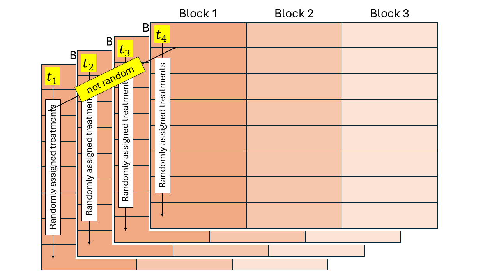

# Día 2 (tarde): Conexión entre diseños experimentales y modelos estadísticos.    

## Repeated measures designs 

Repeated measures designs are similar to split-plot designs, where time is at the subplot level. 
However, an important difference is that time cannot be randomly allocated, 
because it is unidirectional! 
The independence assumption does not hold and should be included in the model. 


```{r fig.height=5, fig.align='center', echo=FALSE, caption = 'Schematic diagram of a split-plot design'}

```


`r popup_btn(button_text = "Repeated measures example for animal science.", modal_text = "Here is what a repeated measures for a barn experiment looks like:", modal_image = "figures/pigs_repeated.PNG")`


$$y_{ijk} = \mu + \tau_i + \alpha_j + (\tau \alpha)_{ij} + u_{k} + v_{ijk} + \varepsilon_{ijk},\\
u_{k} \sim N(0, \sigma^2_u),$$

where $y_{ijk}$ is the observation for the $i$th treatment, $j$th time, in the $k$th block, 
$\mu$ is the overall mean, 
$\tau_i$ is the main effect of the $i$th level of treatment factor 1 (treatment), 
$\alpha_j$ is the main effect of the $j$th level of treatment factor 2 (time), 
$(\tau \alpha)_{ij}$ is their interaction, 
$u_k$ is the random effect of the $k$th block, 
$v_{ijk}$ is the random effect of the $i$th "miniblock" (whole plot) at the $j$th time, in the $k$th block,
and $\varepsilon_{ijk}$ is the residual. 

This time, unlike split-plots, $v_{ijk} \nsim N(0, \sigma^2_v)$ because 
the treatment levels are not randomly assigned! Time is unidirectional and cannot be randomized. 
We can describe how different observations of a treatment $i$ in block $k$ are correlated, by looking at
the distribution of $\mathbf{v}_{ik}$:

$$\mathbf{v}_{ik} \sim N(\boldsymbol{0}, \Sigma_{v, ik}), \\
\Sigma_{v, ik} = \sigma^2_v \begin{bmatrix} 1 & \rho & \rho^2 \\
\rho & 1 & \rho \\
\rho^2 & \rho & 1\end{bmatrix}.$$

This example shows a first order autoregressive covariance structure. 
Other covariance functions include the compound symmetry covariance function, 
$$\mathbf{v}_{ik} \sim N(\boldsymbol{0}, \Sigma_{v, ik}), \\
\Sigma_{v, ik} = \sigma^2_v \begin{bmatrix} 1 & \rho & \rho \\
\rho & 1 & \rho \\
\rho & \rho & 1\end{bmatrix}.$$ and
the unstructured covariance function, $$\mathbf{v}_{ik} \sim N(\boldsymbol{0}, \Sigma_{v, ik}), \\
\Sigma_{v, ik} = \sigma^2_v \begin{bmatrix} 1 & \sigma^2_{12} & \sigma^2_{13} \\
\sigma^2_{21} & 1 & \sigma^2_{23} \\
\sigma^2_{31} & \sigma^2_{32} & 1\end{bmatrix}.$$

Note that we are still affecting the $\mathbf{G}$ matrix, not the $\mathbf{R}$ matrix -- the residuals $\varepsilon_{ijk}$ are still iid normal. 
This difference may affect inference in non-normal responses (not the case yet), 
and is typically a modeling decision that should be carefully considered by the scientist. 
For other types of correlation functions and a discussion of the implications of 
G-side versus R-side correlations see [Johnson and Milliken (2009)](https://doi.org/10.1201/EBK1584883340), 
[Stroup et al. (2024)](https://www.routledge.com/Generalized-Linear-Mixed-Models-Modern-Concepts-Methods-and-Applications/Stroup-Ptukhina-Garai/p/book/9781498755566?srsltid=AfmBOop80SBSwTFMCIzkiTtYe-5uir_Xnw2KVZxa1oXb4LJWrLRx0Wwq), 
and [Muff et al. (2016)](https://besjournals.onlinelibrary.wiley.com/doi/full/10.1111/2041-210X.12623).  


### Model selection for different covariance structures 

How do we know what the best covariance structure is? 

<head>
    <meta charset="UTF-8">
    <meta name="viewport" content="width=device-width, initial-scale=1.0">
    <title>Covariance structures for repeated measures</title>
    <style>
        table {
            width: 100%;
            border-collapse: collapse;
            margin: 20px 0;
        }
        th, td {
            border: 1px solid #ddd;
            padding: 8px;
            text-align: left;
        }
        th {
            background-color: #f4f4f4;
            font-weight: bold;
        }
        tr:nth-child(even) {
            background-color: #f9f9f9;
        }
    </style>
</head>

<body>

<table>
    <tr>
        <th>Covariance function</th>
        <th>Abbreviations</th>
        <th>Extra parameters estimated</th>
        <th>Formula</th>
    </tr>
    <tr>
        <th>No covariance</th>
        <td></td>
        <td></td>
        <td>$\boldsymbol{\Sigma}_{ik} =
            \sigma^2 
            \begin{bmatrix}
            1 & 0 & 0 & 0 & 0 \\
            0 & 1 & 0 & 0 & 0 \\
            0 & 0 & 1 & 0 & 0 \\
            0 & 0 & 0 & 1 & 0 \\
            0 & 0 & 0 & 0 & 1\\
            \end{bmatrix}$</td>
    </tr>
    <tr>
        <th>Compound symmetry</th>
        <td>CS</td>
        <td>$\rho$</td>
        <td>$\boldsymbol{\Sigma}_{ik} =
            \sigma^2 
            \begin{bmatrix}
            1 & \rho & \rho & \rho & \rho \\
            \rho & 1 & \rho & \rho & \rho \\
            \rho & \rho & 1 & \rho & \rho \\
            \rho & \rho & \rho & 1 & \rho \\
            \rho & \rho & \rho & \rho & 1\\
            \end{bmatrix}$</td>
    </tr>
    <tr>
        <th>First-order autoregressive</th>
        <td>AR(1)</td>
        <td>$\rho$</td>
        <td>$\boldsymbol{\Sigma}_{ik} =
            \sigma^2 
            \begin{bmatrix}
            1 & \rho & \rho^2 & \rho^3 & \rho^4 \\
            \rho & 1 & \rho & \rho^2 & \rho^3 \\
            \rho^2 & \rho & 1 & \rho & \rho^2 \\
            \rho^3 & \rho^2 & \rho & 1 & \rho \\
            \rho^4 & \rho^3 & \rho^2 & \rho & 1\\
            \end{bmatrix}$</td>
    </tr>
    <tr>
        <th>First-order ante-dependence</th>
        <td>ANTE(1)</td>
        <td>$\sigma^2_M$ and $\rho$</td>
        <td>$\boldsymbol{\Sigma}_{ik} =
            \sigma_M^2 
            \begin{bmatrix}
            1 & \rho & \rho^2 & \rho^3 & \rho^4 \\
            \rho & 1 & \rho & \rho^2 & \rho^3 \\
            \rho^2 & \rho & 1 & \rho & \rho^2 \\
            \rho^3 & \rho^2 & \rho & 1 & \rho \\
            \rho^4 & \rho^3 & \rho^2 & \rho & 1\\
            \end{bmatrix}$</td>
    </tr>
    <tr>
        <th>Unstructured</th>
        <td>UN</td>
        <td>$m!$</td>
        <td>$\boldsymbol{\Sigma}_{ik} =
            \begin{bmatrix}
            \sigma^2_{1} & \sigma^2_{12} & \sigma^2_{13} & \sigma^2_{14} & \sigma^2_{15} \\
             & \sigma^2_{2} & \sigma^2_{23} & \sigma^2_{24} & \sigma^2_{25} \\
             &   & \sigma^2_{3} & \sigma^2_{34} & \sigma^2_{35} \\
              &  &  & \sigma^2_{4} & \sigma^2_{45} \\
             &  &  &  & \sigma^2_{5} \\
            \end{bmatrix}$</td>
    </tr>
</table>
</body>

### Utilizing UN as the reference covariance 


### G-side versus R-side correlation


## Ejercicios 

[Get R code]()

