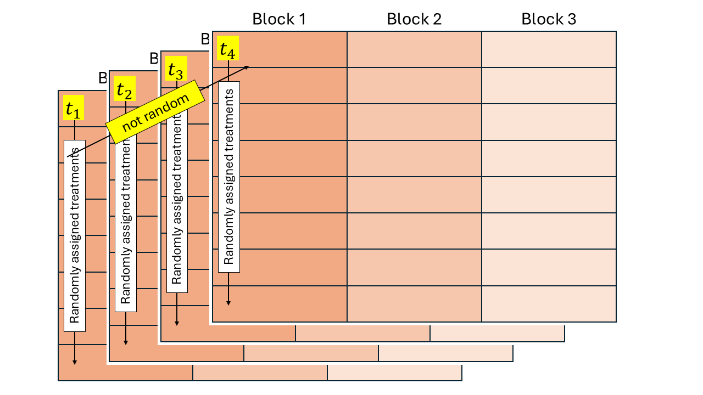

# Día 2 (tarde): Conexión entre diseños experimentales y modelos estadísticos.    

## Repeated measures designs 

Repeated measures designs are similar to split-plot designs, where time is at the subplot level. 
However, an important difference is that time cannot be randomly allocated, 
because it is unidirectional! 
The independence assumption does not hold and should be included in the model. 


```{r fig.height=5, fig.align='center', echo=FALSE, caption = 'Schematic diagram of a split-plot design'}

```


`r popup_btn(button_text = "Repeated measures example for animal science.", modal_text = "Here is what a repeated measures for a barn experiment looks like:", modal_image = "figures/pigs_repeated.PNG")`


$$y_{ijk} = \mu + \tau_i + \alpha_j + (\tau \alpha)_{ij} + u_{k} + v_{ijk} + \varepsilon_{ijk},\\
u_{k} \sim N(0, \sigma^2_u),$$

where $y_{ijk}$ is the observation for the $i$th treatment, $j$th time, in the $k$th block, 
$\mu$ is the overall mean, 
$\tau_i$ is the main effect of the $i$th level of treatment factor 1 (treatment), 
$\alpha_j$ is the main effect of the $j$th level of treatment factor 2 (time), 
$(\tau \alpha)_{ij}$ is their interaction, 
$u_k$ is the random effect of the $k$th block, 
$v_{ijk}$ is the random effect of the $i$th "miniblock" (whole plot) at the $j$th time, in the $k$th block,
and $\varepsilon_{ijk}$ is the residual. 

This time, unlike split-plots, $v_{ijk} \nsim N(0, \sigma^2_v)$ because 
the treatment levels are not randomly assigned! Time is unidirectional and cannot be randomized. 
We can describe how different observations of a treatment $i$ in block $k$ are correlated, by looking at
the distribution of $\mathbf{v}_{ik}$:

$$\mathbf{v}_{ik} \sim N(\boldsymbol{0}, \Sigma_{v, ik}), \\
\Sigma_{v, ik} = \sigma^2_v \begin{bmatrix} 1 & \rho & \rho^2 \\
\rho & 1 & \rho \\
\rho^2 & \rho & 1\end{bmatrix}.$$

This example shows a first order autoregressive covariance structure. 
Other covariance functions include the compound symmetry covariance function, 
$$\mathbf{v}_{ik} \sim N(\boldsymbol{0}, \Sigma_{v, ik}), \\
\Sigma_{v, ik} = \sigma^2_v \begin{bmatrix} 1 & \rho & \rho \\
\rho & 1 & \rho \\
\rho & \rho & 1\end{bmatrix}.$$ and
the unstructured covariance function, $$\mathbf{v}_{ik} \sim N(\boldsymbol{0}, \Sigma_{v, ik}), \\
\Sigma_{v, ik} = \sigma^2_v \begin{bmatrix} 1 & \sigma_{12} & \sigma_{13} \\
\sigma_{21} & 1 & \sigma_{23} \\
\sigma_{31} & \sigma_{32} & 1\end{bmatrix}.$$

Note that we are still affecting the $\mathbf{G}$ matrix, not the $\mathbf{R}$ matrix -- the residuals $\varepsilon_{ijk}$ are still iid normal. 
This difference may affect inference in non-normal responses (not the case yet), 
and is typically a modeling decision that should be carefully considered by the scientist. 
For other types of correlation functions and a discussion of the implications of 
G-side versus R-side correlations see [Johnson and Milliken (2009)](https://doi.org/10.1201/EBK1584883340), 
[Stroup et al. (2024)](https://www.routledge.com/Generalized-Linear-Mixed-Models-Modern-Concepts-Methods-and-Applications/Stroup-Ptukhina-Garai/p/book/9781498755566?srsltid=AfmBOop80SBSwTFMCIzkiTtYe-5uir_Xnw2KVZxa1oXb4LJWrLRx0Wwq), 
and [Muff et al. (2016)](https://besjournals.onlinelibrary.wiley.com/doi/full/10.1111/2041-210X.12623).  


### Model selection for different covariance structures 

How do we know what the best covariance structure is? 

<head>
    <meta charset="UTF-8">
    <meta name="viewport" content="width=device-width, initial-scale=1.0">
    <title>Covariance structures for repeated measures</title>
    <style>
        table {
            width: 100%;
            border-collapse: collapse;
            margin: 20px 0;
        }
        th, td {
            border: 1px solid #ddd;
            padding: 8px;
            text-align: left;
        }
        th {
            background-color: #f4f4f4;
            font-weight: bold;
        }
        tr:nth-child(even) {
            background-color: #f9f9f9;
        }
    </style>
</head>

<body>

<table>
    <tr>
        <th>Covariance function</th>
        <th>Number of parameters estimated</th>
        <th>Formula</th>
    </tr>
    <tr>
        <th>No covariance</th>
        <td>1: $\sigma$</td>
        <td>$\boldsymbol{\Sigma}_{ik} =
            \sigma^2 
            \begin{bmatrix}
            1 & 0 & 0 & 0 & 0 \\
            0 & 1 & 0 & 0 & 0 \\
            0 & 0 & 1 & 0 & 0 \\
            0 & 0 & 0 & 1 & 0 \\
            0 & 0 & 0 & 0 & 1\\
            \end{bmatrix}$</td>
    </tr>
    <tr>
        <th>Compound symmetry (CS)</th>
        <td>2: $\sigma$ and $\rho$</td>
        <td>$\boldsymbol{\Sigma}_{ik} =
            \sigma^2 
            \begin{bmatrix}
            1 & \rho & \rho & \rho & \rho \\
            \rho & 1 & \rho & \rho & \rho \\
            \rho & \rho & 1 & \rho & \rho \\
            \rho & \rho & \rho & 1 & \rho \\
            \rho & \rho & \rho & \rho & 1\\
            \end{bmatrix}$</td>
    </tr>
    <tr>
        <th>First-order autoregressive (AR(1))</th>
        <td>2: $\sigma$ and $\rho$</td>
        <td>$\boldsymbol{\Sigma}_{ik} =
            \sigma^2 
            \begin{bmatrix}
            1 & \rho & \rho^2 & \rho^3 & \rho^4 \\
            \rho & 1 & \rho & \rho^2 & \rho^3 \\
            \rho^2 & \rho & 1 & \rho & \rho^2 \\
            \rho^3 & \rho^2 & \rho & 1 & \rho \\
            \rho^4 & \rho^3 & \rho^2 & \rho & 1\\
            \end{bmatrix}$</td>
    </tr>
    <tr>
        <th>Toeplitz (homogeneous)</th>
        <td>$t$</td>
        <td>$\boldsymbol{\Sigma}_{ik} =
            \begin{bmatrix}
            \sigma^2 & \sigma_1 & \sigma_2 & \sigma_3 & \sigma_4 \\
            \sigma_1 & \sigma^2 & \sigma_1 & \sigma_2 & \sigma_3 \\
            \sigma_2 & \sigma_1 & \sigma^2 & \sigma_1 & \sigma_2 \\
            \sigma_3 & \sigma_2 & \sigma_1 & \sigma^2 & \rho \\
            \sigma_4 & \sigma_3 & \sigma_2 & \sigma_1 & \sigma^2\\
            \end{bmatrix}$</td>
    </tr>
    <tr>
        <th>Heterogeneous compound symmetry (HCS)</th>
        <td>$t+1$</td>
        <td>$\boldsymbol{\Sigma}_{ik} =
            \sigma^2 
            \begin{bmatrix}
            \sigma^2_1 & \sigma_1 \sigma_2 \rho & \sigma_1 \sigma_3 \rho & \sigma_1 \sigma_4 \rho & \sigma_1 \sigma_5 \rho \\
            \sigma_2 \sigma_1 \rho & \sigma^2_2 & \sigma_2 \sigma_3 \rho & \sigma_2 \sigma_4 \rho & \sigma_2 \sigma_5 \rho \\
            \sigma_3 \sigma_1 & \sigma_3 \sigma_2 \rho & \sigma^2_3 & \sigma_3 \sigma_4 \rho & \sigma_3 \sigma_5 \rho \\
            \sigma_4 \sigma_1 \rho & \sigma_4 \sigma_2 \rho & \sigma_4 \sigma_3 \rho & \sigma^2_4 & \sigma_4 \sigma_5 \rho \\
            \sigma_5 \sigma_1 \rho & \sigma_5 \sigma_2 \rho & \sigma_5 \sigma_3 \rho & \sigma_5 \sigma_4 \rho & \sigma^2_5\\
            \end{bmatrix}$</td>
    </tr>
    <tr>
        <th>Unstructured (UN)</th>
        <td>$t(t+1)/2$</td>
        <td>$\boldsymbol{\Sigma}_{ik} =
            \begin{bmatrix}
            \sigma^2_{1} & \sigma_{12} & \sigma_{13} & \sigma_{14} & \sigma_{15} \\
             & \sigma^2_{2} & \sigma_{23} & \sigma_{24} & \sigma_{25} \\
             &   & \sigma^2_{3} & \sigma_{34} & \sigma_{35} \\
              &  &  & \sigma^2_{4} & \sigma_{45} \\
             &  &  &  & \sigma^2_{5} \\
            \end{bmatrix}$</td>
    </tr>
</table>
</body>

## Selecting the covariance structure 


How do we decide what's the best covariance structure for our data?  

- Over-modeling correlation compromises power and under-modeling compromises type I error control. 
- Information criteria: 
  - Used as a metric for predictive ability and model fit. 
  - Lower value = better 
  - No general rule about AIC magnitude 
  - Akaike Information Criterion (AIC): $\text{AIC} = 2p - 2 \ln(\hat{L})$ 
  - AICC: correction for small sample sizes $\text{AICc} = \text{AIC} + \frac{2p^2+2p}{n-p-1}$ 
  - Bayesian Information Criterion (BIC) $\text{BIC} = p \log(n) -2\log(\hat{L})$ 
  - [$p$: number of parameters estimated in the model, $\hat{L}$: likelihood for the model, $\hat{L}=p(\mathbf{y}\vert \hat{\boldsymbol{\beta}}, M)$]
  - Plot covariance as a function of distance (could be time or space).  
  - Likelihood ratio tests are not always reliable for mixed models [[see Bolker's GLMM FAQ](https://bbolker.github.io/mixedmodels-misc/glmmFAQ.html#is-the-likelihood-ratio-test-reliable-for-mixed-models)] 

- Is there a clear reasonable assumption about the data-generating process? 
- Use UN as the reference: 
  - UN covariance structure is the most complex because it is estimating unique $\sigma$s for each pair of time points
  - Select the covariance structure that is most similar to UN. 

### Applied example

The data were generated by an experiment that studied the effects of different feeding treatments on pigs. 
A total of 350 pigs were used in this study, with dietary treatment applied to each pen in a completely randomized design.
Pig body temperature was measured at 5 points in time. 
The researchers wished to know if the feeding treatments affect body temperature. 

$$y_{ijk} = \mu + \tau_i + \alpha_j + (\tau \alpha)_{ij} + u_{k} + v_{i j k} + \varepsilon_{ijk},\\
u_{k} \sim N(0, \sigma^2_u), \\
\varepsilon_{ijk} \sim N(0, \sigma^2),$$

where $y_{ij}$ is the observed temperature for the $i$th feed treatment, 
in the $k$th pen, 
on the $j$th day,  
$\mu$ is the overall mean, 
$\tau_i$ is the (fixed) effect of the $i$th feed treatment, 
$\alpha_j$ is the (fixed) effect of the $j$th day, 
$(\tau \alpha)_{ij}$ is the interaction between the $i$th feed treatment and the $j$th day, 
$\varepsilon_{ijk}$ is the residual (i.e., the difference between predicted and observed) of the $i$th feed treatment, 
in the $k$th pen, 
on the $j$th day,  

Note that we didn't specify the distribution for $v_{i j k}$. 
Normally we would have said $v_{ijk} \sim N(0, \sigma^2_v)$, but now, the observations are 
not completely independent because they are following the same experimental unit through time. 
Assuming a first-order autoregressive structure, we can say 

$$\mathbf{v}_{i k} \sim N(\boldsymbol{0}, \Sigma_{v,ik}), \\
\Sigma_{v,ik} = \sigma_v^2 \begin{bmatrix} 
1 & \rho & \rho^2 & \rho^3 & \rho^4 \\
\rho & 1 & \rho & \rho^2 & \rho^3 \\
\rho^2 & \rho & 1 & \rho & \rho^2 \\
\rho^3 & \rho^2 & \rho & 1 & \rho \\
\rho^4 & \rho^3 & \rho^2 & \rho & 1 \end{bmatrix}.$$


```{r message=FALSE, warning=FALSE}
library(glmmTMB)
library(DHARMa)
library(multcomp)
```

```{r}
dd_temp <- read.csv("../data/temperature_2.csv")
options(contrasts = c("contr.treatment", "contr.poly"))

dd_temp$Pig <- as.factor(dd_temp$Pig)
dd_temp$Treatment <- as.factor(dd_temp$Treatment)
dd_temp$Pen <- as.factor(dd_temp$Pen)
dd_temp$Time <- as.factor(dd_temp$Time)
dd_temp$Temperature_F <- (dd_temp$Temperature_C *9/5) + 32  

m_repeated_ar1 <- 
  glmmTMB(Temperature_F ~ Treatment * Time + ar1(0 + Time |Pen),
          REML = TRUE,
          family = gaussian(link = "identity"),
          data = dd_temp)

```

```{r}
m_repeated_toep <- 
  glmmTMB(Temperature_F ~ Treatment * Time + toep(0 + Time |Pen) ,
          REML = TRUE,
          family = gaussian(link = "identity"),
          data = dd_temp)

```

```{r}
res_repeated <- simulateResiduals(m_repeated_ar1, plot = TRUE)
res_repeated <- simulateResiduals(m_repeated_toep, plot = TRUE)
AIC(m_repeated_ar1, m_repeated_toep)
BIC(m_repeated_ar1, m_repeated_toep)
performance::performance_aicc(m_repeated_ar1)
performance::performance_aicc(m_repeated_toep)

```

```{r}
marginal_means_temp <- emmeans(m_repeated_toep, ~ Treatment|Time)

cld(marginal_means_temp, 
    adjust = "sidak", 
    Letters = letters)
```

## Modeling the time dependence: conditional versus marginal

Time dependencies can be specified on the $\mathbf{G}$ matrix, or in the $\mathbf{R}$ matrix. 

- What's the focus of the study: 
  - Example: following a population of animals/plants versus following a single animal/plant. 
- "Conditional and Marginal Models: Another View" [Lee and Nelder (2004)](https://projecteuclid.org/journals/statistical-science/volume-19/issue-2/Conditional-and-Marginal-Models-Another-View/10.1214/088342304000000305.full)


## In-class exercise

Analyze the data. [Get R code.](../scripts/dia2_inclass_ex.qmd).

## More resources for repeated measures 

- Guidelines for Selecting the Covariance Structure in Mixed Model Analysis [[link](https://support.sas.com/resources/papers/proceedings/proceedings/sugi30/198-30.pdf)] 

## Tarea 

- Read [Gelman (2012)](https://doi.org/10.1198/004017005000000661)
