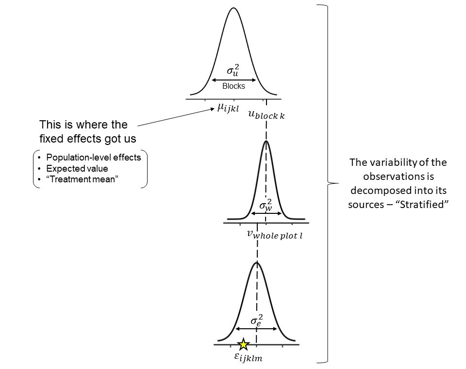

# Día 3 (mañana): Pensar un modelo jerárquico.

## Review 

## Statistical models 

Statistical models are combinations of deterministic and stochastic processes. 
We often refer to the deterministic process as the equation that constitutes the linear predictor. 
For example, if we were describing the environmental factors affecting grain yield (e.g, intercepted solar radiation, vapor pressure deficit, water availability, etc.) we could define the linear predictor as a combination of 


### Hierarchical models 


```{r fig.height=9, fig.align='center', echo=FALSE, caption = 'Schematic diagram of a hierarchical model.'}

```


