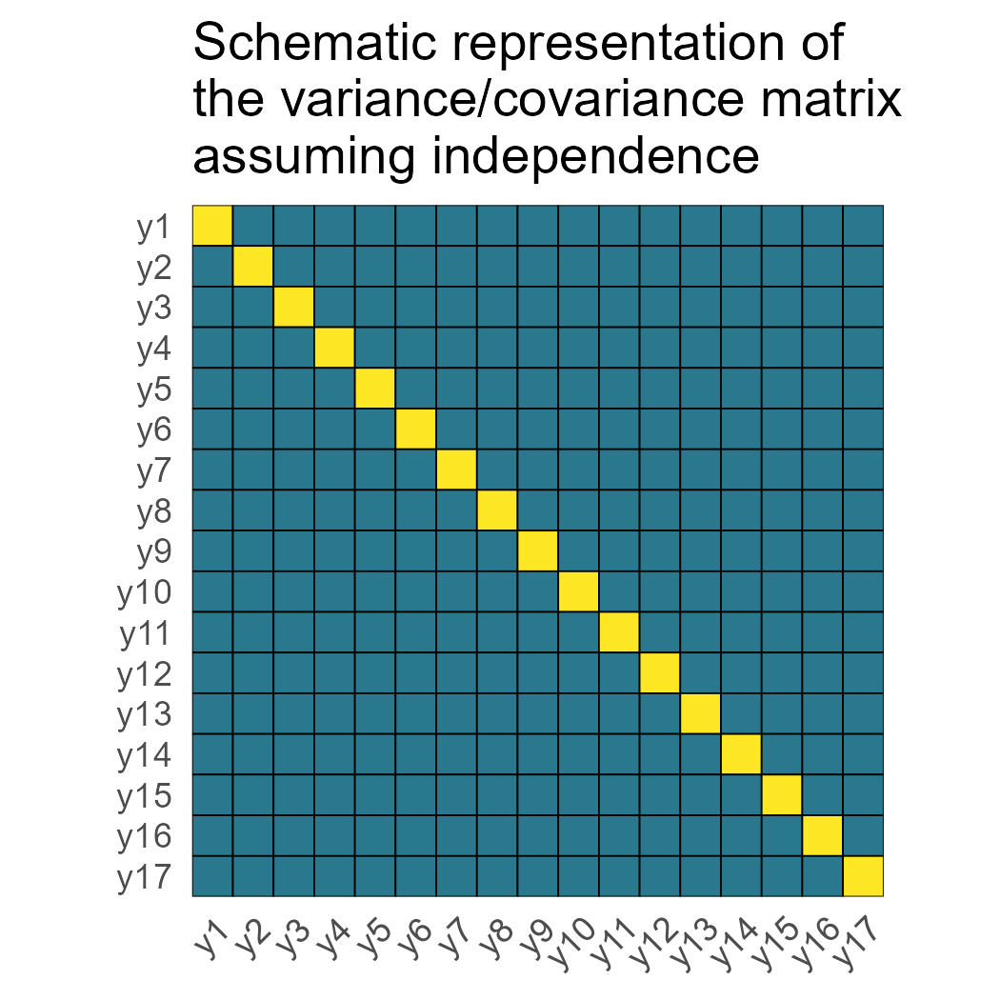
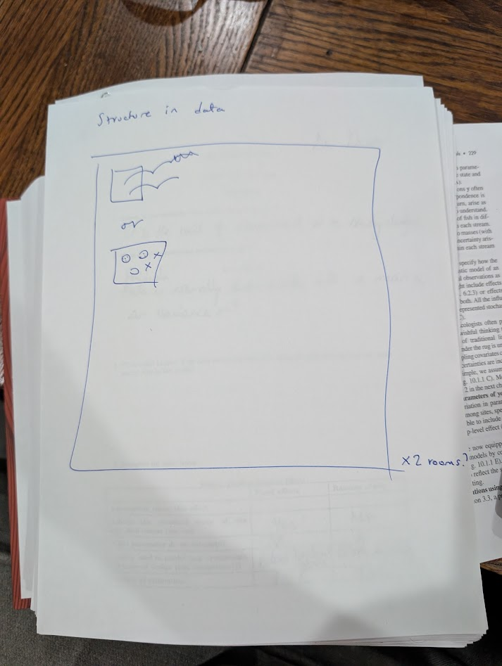
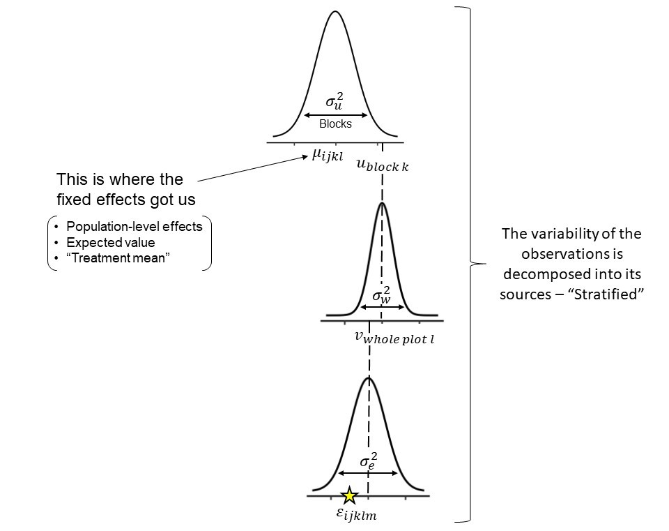

# Día 3 (mañana): Pensar un modelo jerárquico.

## Discusión: qué dice Dixon? 

- Discusión del paper [Yates (1940)]() -- 30 minutos. 


## Review 

Consider the linear mixed model 

$$\mathbf{y} \sim N(\mathbf{X}\boldsymbol{\beta}, \mathbf{V}),$$
where:

- $\mathbf{y}$ is the vector of the response, 
- $\mathbf{X}$ is the model matrix (often containing treatment allocation), 
- $\boldsymbol{\beta}$ is a vector containing the estimates for the effects of all variables in $\mathbf{X}$, 
- $\mathbf{V}$ is the variance covariance matrix for $\mathbf{y}$. 

**All-fixed effects models typically assume**

```{r fig.height=4, fig.align='center', echo=FALSE, caption = 'Schematic diagram of a hierarchical model.'}

```


## Statistical models 

Statistical models are combinations of deterministic and stochastic processes. 
We often refer to the deterministic process as the equation that constitutes the linear predictor. 
This outline is partly inspired by Chapter 10 in [Hooten and Hobbs (2025)]().

## Writing hierarchical models 

**1. Start with the data.** 

What is the distribution of the data? Right now we will focus on Gaussian data, but be mindful that there are a myriad of probability distributions that can be used to analyze the data.  

**2. Think about the structure in the data** 

Draw the data blueprint. 

```{r fig.height=5, fig.align='center', echo=FALSE, caption = 'Schematic diagram of data with a hierarchical structure.'}

```

**3. Think about **

```{r fig.height=9, fig.align='center', echo=FALSE, caption = 'Schematic diagram of a hierarchical model.'}

```


### Ejercicio 

example w IBD: what happens to $\hat{\boldsymbol{\beta}}$ if we assume blocks fixed versus random? 


