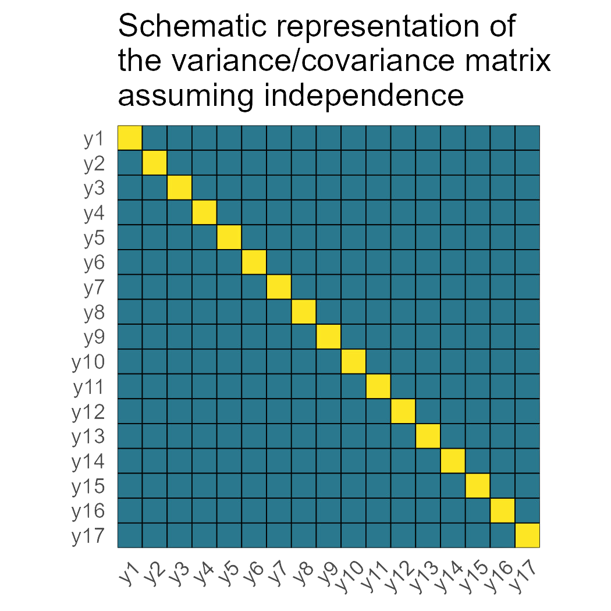
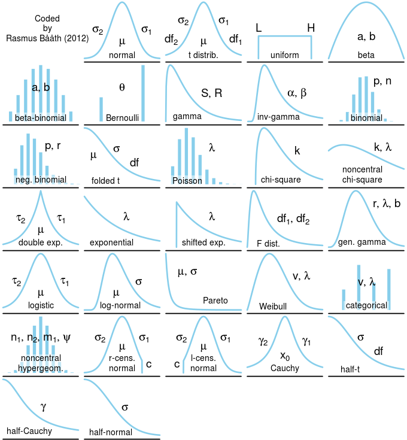

# Día 3 (tarde): Pensar un modelo jerárquico.

## Discusión: qué dice Gelman? 

- Discusión del paper [Gelman (2012)](https://doi.org/10.1198/004017005000000661) -- 30 minutos. 

## Review 

Consider the linear mixed model 

$$\mathbf{y} \sim N(\mathbf{X}\boldsymbol{\beta}, \mathbf{V}),$$
where:

- $\mathbf{y}$ is the vector of the response, 
- $\mathbf{X}$ is the model matrix (often containing treatment allocation), 
- $\boldsymbol{\beta}$ is a vector containing the estimates for the effects of all variables in $\mathbf{X}$, 
- $\mathbf{V}$ is the variance covariance matrix for $\mathbf{y}$. 

**All-fixed effects models typically assume**

```{r fig.height=4, fig.align='center', echo=FALSE, caption = 'Schematic diagram of a hierarchical model.'}

```


## Statistical models 

Statistical models are combinations of deterministic and stochastic processes. 
We often refer to the deterministic process as the equation that constitutes the linear predictor. 
This outline is partly inspired by Chapter 10 in [Hooten and Hobbs (2025)](https://press.princeton.edu/books/hardcover/9780691250120/bayesian-models?srsltid=AU7gw4XrxXv4WgkeZ7SDUf7BURJHS-iIeRJtBGGwNqo2PnWM1Yha58Np).

## Writing hierarchical models 

**1. Start with the data.** 

What is the distribution of the data? Right now we will focus on Gaussian data, but be mindful that there are a myriad of probability distributions that can be used to analyze the data.  

```{r fig.height=4, fig.align='center', echo=FALSE, caption = 'Common distributions used in statistical modeling.'}

```

**2. Think about the structure in the data** 

The structure in the data is what mixed models model best. 
This refers to the groups of data that were generated together. Multiple authors/statisticians have eluded to this concept using different words:  

- "Topographical structure" or "design structure" in Chapter 2 in Stroup et al. (2024). 
- "Blocking structure" as decribed in [Edmonson (2020)](https://link.springer.com/article/10.1007/s13253-020-00416-0). 

Oftentimes, there is no textbook definition to a specific data structure like "split-plot design". 
In those cases, it is helpful to draw the blueprint in the data to figure out the structure in the data. 

```{r fig.height=5, fig.align='center', echo=FALSE, caption = 'Schematic diagram of data with a hierarchical structure.'}
knitr::include_graphics("figures/structure_doodle.jpg")
```

**3. Think about the treatment effects**

Additionally, the treatments (or other covariates may have) effects on the response. 
Generally, these elements of the model are added independently of the blueprint in the data. 

**4. Write the full statistical model**

The full statistical model combines both topographical (i.e., design) and treatment structures. 

```{r fig.height=9, fig.align='center', echo=FALSE, caption = 'Schematic diagram of a hierarchical model.'}
knitr::include_graphics("figures/hierarchical2.jpg")
```

## Applied example 


The data are unbalanced in both the number of observations per environment and the number of observations of the different genotypes. 

A few important points: 

- Not all genotypes are present in all environments 
- Not all environments were evaluated every year 


```{r message=FALSE, warning=FALSE}
dat <- agridat::george.wheat |> 
  filter(year>2014, loc !="Fresno") |> 
  mutate(env = paste(loc,year), 
         year = as.factor(year), 
         gen = as.factor(gen))

dat |> 
  ggplot(aes(yield))+
  geom_histogram(aes(fill = factor(year)))+
  labs(fill = "Year")+
  theme_pubr()+
  theme(legend.position = "bottom")+
  facet_wrap(~loc, ncol = 4)
```


```{r}
model <- lmer(yield ~ (1|gen) + 
                (1|gen:loc) + (1|gen:year) + (1|gen:year:loc) +
                (1|year) + (1|loc) + (1|year:loc) + 
                (1|block:year:loc),
              data = dat)
```

```{r}
hist(resid(model))
plot(predict(model), resid(model))
```

```{r}
summary(model)
```

```{r}
# plot(emmeans(model, ~gen))

dat_pred <- expand.grid(loc = unique(dat$loc), 
                        gen = unique(dat$gen)) |> 
  left_join(dat |> dplyr::select(loc, gen) |>
              unique() |> mutate(present = "yes")) |> 
  mutate(present = ifelse(is.na(present), "no", present))

pred <- predict(model,
                newdata = dat_pred,
                re.form = ~ (1|gen) + (1|loc) + (1|gen:loc), 
                allow.new.levels = TRUE,
                se = T)

dat_pred$yhat <- pred$fit
dat_pred$se <- pred$se.fit
```

```{r warning = F, message=F}
dat_pred |> 
  ggplot(aes(gen, yhat))+
  geom_errorbar(aes(ymin = yhat - se*1.96,ymax = yhat + se*1.96), shape =21)+
  geom_point(aes(fill = loc), shape =21)+
  labs(fill = "Location")+
  theme(legend.position = "bottom")+
  facet_wrap(~loc, ncol = 4)
```

## Tarea 

- Leer capítulo 11 en [Gelman and Hill (2006)](https://www.amazon.com/Analysis-Regression-Multilevel-Hierarchical-Models/dp/052168689X/ref=pd_lpo_sccl_3/131-3172861-4727912?pd_rd_w=mjiqJ&content-id=amzn1.sym.4c8c52db-06f8-4e42-8e56-912796f2ea6c&pf_rd_p=4c8c52db-06f8-4e42-8e56-912796f2ea6c&pf_rd_r=G0DJKJDQA9GM5S2RABKA&pd_rd_wg=Apa9i&pd_rd_r=e8be25f9-32fa-442e-a7e6-e51f94e5d229&pd_rd_i=052168689X&psc=1)

