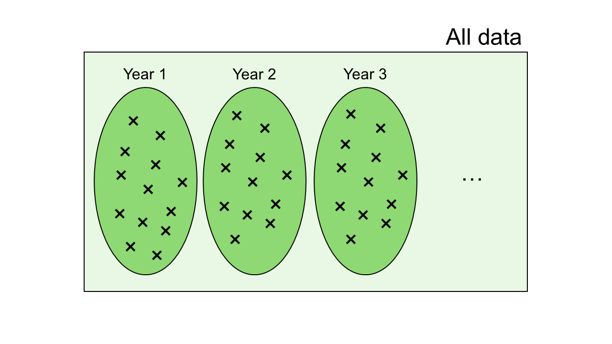

# Día 4 (mañana): Casos aplicados 

## Review so far  

- Study objectives may include [prediction, estimation, and attribution](https://www.tandfonline.com/doi/abs/10.1080/01621459.2020.1762613) 
- Statistical methods have different strengths and may be more (or less) useful depending on the data-method combination. 
- Statistical inference is the most rich when we focus on effect sizes and confidence intervals. 
- Mixed models are especially useful to model data that show dependence 

## Environmental covariates 

Just like nested designs (e.g., split-plot designs), we can model multi-year environment data fairly easily using mixed models. 
The data below come from a multi-environment trial evaluating barley height in different environments with multiple weather covariates (i.e., years with different environmental covariates).


```{r eval=FALSE, include=FALSE}
dat_crop <- agridat::aastveit.barley.height
dat_env <- agridat::aastveit.barley.covs
colnames(dat_env) <- c(
  "year",
  "rainfall_1", "rainfall_2", "rainfall_3", "rainfall_4", "rainfall_5", "rainfall_6",
  "srad_1", "srad_2", "srad_3", "srad_4", "srad_5", "srad_6", "sowing_t",
  "temp_1", "temp_2", "temp_3", "temp_4", "temp_5", "temp_6")

dat_merged <- left_join(dat_crop, dat_env)
```


```{r}
# data adapted from the agridat R package
dat_merged <- read.csv("../data/data_barley.csv")

dat_merged |> 
  ggplot(aes(year, height))+
  geom_point()+
  theme_pubr()+
  coord_cartesian(ylim = c(0, 110))+
  labs(y = "Height (cm)", y = "Year")

dat_merged |> 
  dplyr::select(-c(gen, height)) |> unique() |> 
  pivot_longer(cols = rainfall_1:temp_6) |> 
  ggplot(aes(year, value))+
  geom_point()+
  theme_pubr()+
  theme(aspect.ratio = .4)+
  facet_wrap(~name, scales = "free_y")+
  labs(y = "Height (cm)", y = "Year")
```

**1. Start with the data.** 

What is the distribution of the data? For now let's assume normal. 

**2. Think about the structure in the data** 

Note that our data contain multiple rows of observed heights, yet the predictors (i.e., weather covariates) are just a few years repeated throughout. 
Thus, although we have multiple rows of data, the real independent data for the predictors are much fewer. Just take a look at the data:

```{r}
head(arrange(dat_merged, year))
```

Although the response shows different values, if we wish to study the relatoinship bewteen the weather covariates and the height, there is an obvious dependence structure. 


```{r fig.height=4, fig.align='center', echo=FALSE, caption = 'Common distributions used in statistical modeling.'}

```

Thus, let's assume the data are nested within years. 

**3. **

**4. Write the full statistical model**  

Given that the blocking structures are the years, the corresponding model is 

$$y_{ij}=\mu_0 + G_i +\beta_1x_{ij} +year_j + \varepsilon_{ij},  \\ year_j\sim N(0, \sigma^2_{year}), \\ \varepsilon_{ij}\sim N(0, \sigma^2_{\varepsilon}).$$

The matching R code is 

```{r}
mod <- lmer(height ~ 1 + gen + rainfall_3 + (1|year),  data = dat_merged)

summary(mod)
```

After appropriate model checking, we can evaluate the effect of rainfall: 

```{r}
emtrends(mod, ~rainfall_3, "rainfall_3")
```
Note the degrees of freedom are 7, because the mixed model recognizes that the weather data are the same for each year, and there is a total of 9 years. 


**What would have happened if we didn't account for this dependence structure in the data?** 

- We would have assumed independent observations.  
- Overconfidence in precision of $\hat{\beta_1}$.  

```{r}
mod_simple <- lm(height ~ gen + rainfall_3,  data = dat_merged)
emtrends(mod_simple, ~rainfall_3, "rainfall_3")
```
